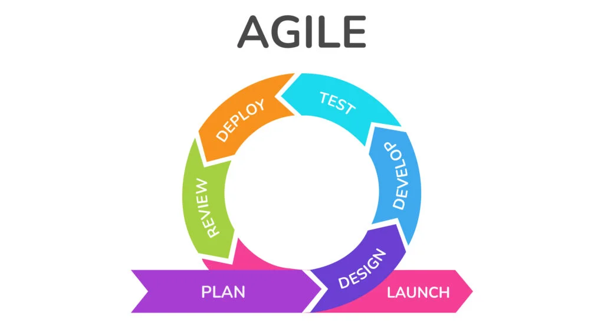

In today’s fast-moving work environment, teams need flexibility, speed, and strong collaboration. The Agile method offers a practical framework that helps teams adapt quickly, deliver value continuously, and improve through feedback.

### What Is Agile?

Agile is a project management and development approach based on iterative progress, collaboration, and responsiveness to change. Instead of delivering everything at the end, teams work in short cycles (called *sprints*) to build, test, and improve incrementally.

### Why Agile Works Well for Teams

**1. Better Collaboration**
Agile encourages daily communication through stand-ups, planning sessions, and retrospectives. Everyone stays aligned, blockers are surfaced early, and team ownership increases.

**2. Faster Feedback, Fewer Surprises**
Work is reviewed at the end of each sprint, allowing stakeholders and teammates to give feedback early. This reduces rework and keeps the product aligned with real needs.

**3. Flexibility and Adaptability**
Agile welcomes change. Teams can adjust priorities or scope based on new insights without derailing the entire project.

**4. Clear Accountability**
Roles like Product Owner, Scrum Master, and the development team help define responsibilities while keeping collaboration strong.

### Core Agile Practices in Teamwork

* **Sprint Planning** – Decide what to build next and set realistic goals.
* **Daily Stand-ups** – Short meetings to share progress and challenges.
* **Sprint Reviews** – Demo completed work and gather feedback.
* **Retrospectives** – Reflect on what worked and what can improve.

