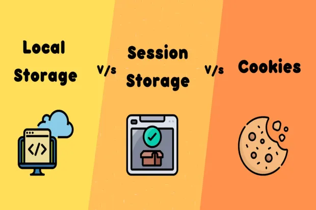

# Cookie

> A **cookie** is a small piece of data that a website stores in the user’s browser. The browser automatically sends cookies back to the server with every request to the same domain.

### Common uses of cookies:

* Keeping users logged in
* Storing user preferences (language, theme)

### Example

When a user logs in, the server may send:

```
Set-Cookie: sessionId=abc123; HttpOnly; Secure;
```

The browser saves this cookie and sends it with future requests:

```
Cookie: sessionId=abc123
```

### Important cookie flags

* **HttpOnly** – JavaScript cannot read the cookie (protects against XSS)
* **Secure** – Cookie is only sent over HTTPS
* **SameSite** – Controls whether cookies are sent in cross-site requests

### Use **cookies** when:

  * You need data sent automatically to the server
  * You are managing login sessions

# Session

> A **session** is a way for the server to remember a user across multiple requests.

Because HTTP is stateless, the server would otherwise forget everything about a user after each request.

### How sessions work

1. User logs in
2. Server creates a unique session ID
3. Server stores user data on the server
4. Server sends the session ID to the browser as a cookie
5. Browser sends the cookie back on every request
6. Server uses the session ID to retrieve user data

### Use **sessions** when:

* You need to store user data securely
* You want to keep server-side state

# Local Storage

> **Local storage** is a browser feature that lets websites store data persistently on the user’s device. It is part of the Web Storage API.

### Key characteristics

| Feature          | Local Storage          |
| ---------------- | ---------------------- |
| Where stored     | Browser                |
| Lifetime         | Until manually cleared |
| Size limit       | ~5–10 MB               |
| Sent to server   | ❌ No                   |
| Accessible by JS | ✅ Yes                  |
| HttpOnly         | ❌ No                   |

### Example

```js
localStorage.setItem("theme", "dark");
const theme = localStorage.getItem("theme");
```

### Use **local storage** when:

  * You need persistent client-side data
  * You are storing UI preferences (theme, language)

