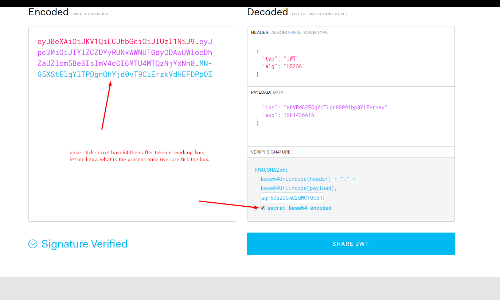
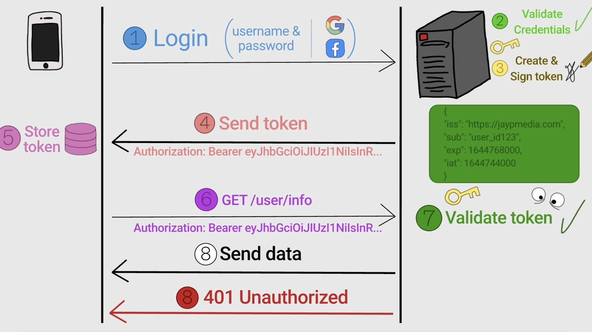

### What is JWT?

**JSON Web Token (JWT)** is an open standard (RFC 7519) that defines a compact and self-contained way to securely transmit information between parties as a JSON object.
JWTs are commonly used for **authentication and authorization** in modern web applications.

The information inside a JWT is **digitally signed**, which allows the receiver to verify that the content has not been tampered with.

---

## 🤔 Why JWT is Popular

JWT is widely adopted in APIs, SPAs, and microservice architectures because it is:

* **Stateless** – no server-side session storage required
* **Compact** – small size, efficient to send via HTTP headers
* **Self-contained** – carries user identity and metadata
* **Scalable** – works well with distributed systems

---

## 🧱 JWT Structure

A JWT consists of **three parts**, separated by dots (`.`):

```
header.payload.signature
```

Each part is Base64URL-encoded.



### 1️⃣ Header

The header describes the token type and the signing algorithm.

```json
{
  "alg": "HS256",
  "typ": "JWT"
}
```

* `alg`: signing algorithm (HS256, RS256, etc.)
* `typ`: token type (JWT)

---

### 2️⃣ Payload (Claims)

The payload contains **claims**, which are statements about the user and additional metadata.

There are three types of claims:

* **Registered claims** (standard):

  * `iss` (issuer)
  * `sub` (subject / user id)
  * `exp` (expiration time)
  * `aud` (audience)

* **Public claims**
  Custom but globally agreed-upon fields.

* **Private claims**
  Custom fields shared between specific systems (e.g. `role`, `email`).

⚠️ Important: The payload is **not encrypted**, only encoded.

---

### 3️⃣ Signature



The signature ensures the token has not been altered.

Example (HS256):

```
HMACSHA256(
  base64UrlEncode(header) + "." +
  base64UrlEncode(payload),
  secret
)
```

The server verifies the signature to confirm the token is valid and trustworthy.

---

## 🔄 How JWT Authentication Works

1. **User logs in** with credentials
2. **Server validates credentials** and generates a JWT
3. **Client stores the token** (cookie or memory)
4. **Client sends JWT** in every request:

   ```
   Authorization: Bearer <token>
   ```
5. **Server verifies the token** and grants access

No session lookup is needed.

---

## ✅ Advantages of JWT

* 🚀 **High performance** (no session storage)
* 🧩 **Great for microservices**
* 🔐 **Tamper-proof** with signature verification
* 🌍 **Language-agnostic** and widely supported

---

## ⚠️ Common Pitfalls & Best Practices

* ❌ **Do not store sensitive data** in the payload
* ❌ Avoid long expiration times
* ✅ Prefer **HTTP-only cookies** over `localStorage` (XSS protection)
* ✅ Always validate `exp`, `iss`, and `aud`
* ✅ Use **RS256** for large or distributed systems

---

## 🏁 Conclusion

JWT is a powerful and flexible solution for authentication in modern web applications.
When used correctly, it enables:

* Stateless authentication
* Better scalability
* Clean API design

However, JWT is **not a silver bullet**—it must be implemented carefully with proper security practices.

---

