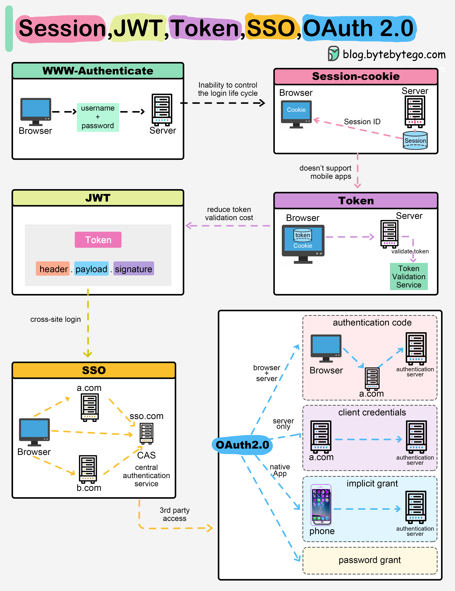
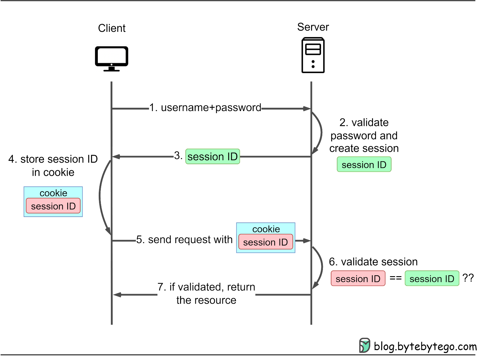
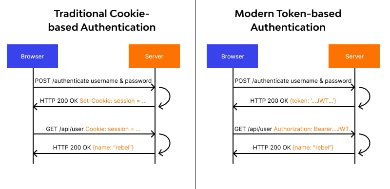
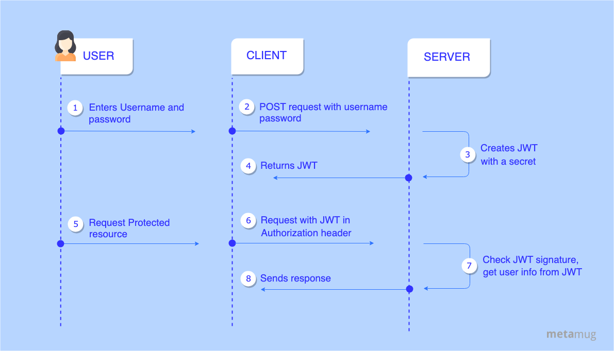
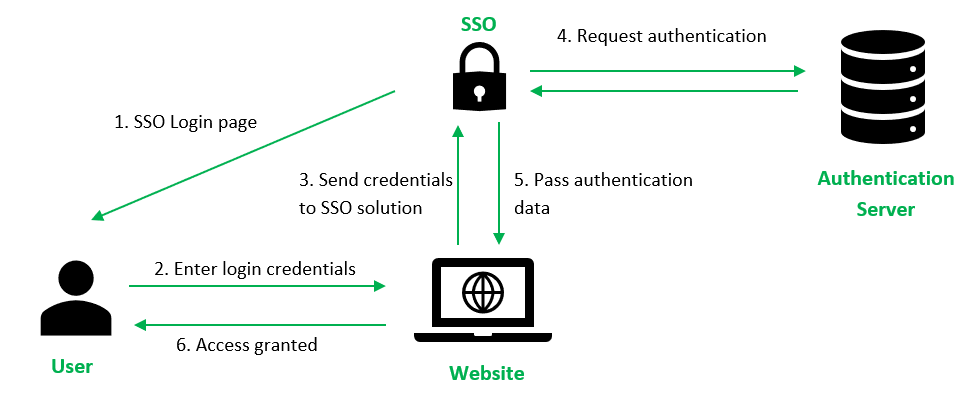
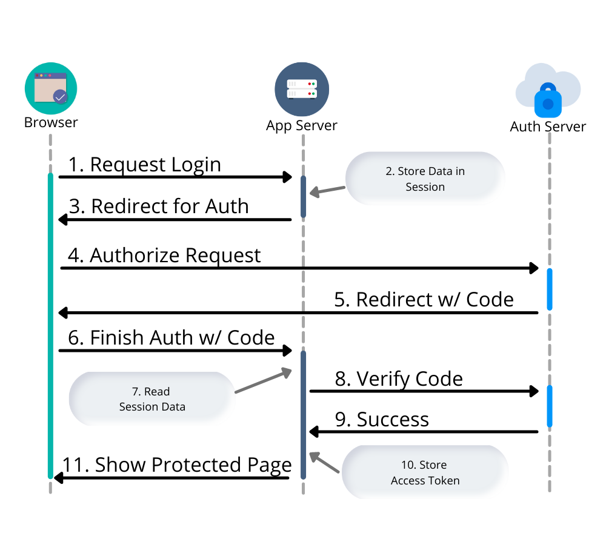
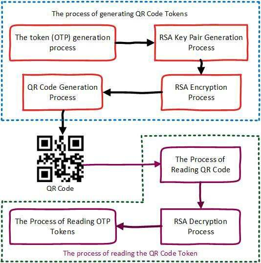

When you log in to a website, the system must **remember who you are** across multiple requests. Over time, different authentication strategies have evolved to solve this problem at different scales and security levels.



Below is a clear explanation of the most common approaches.

---

## 1️⃣ Session-Based Authentication



### How it works

* The **server stores your identity** (user ID, role, etc.)
* The server sends the browser a **session ID** via a cookie
* The browser automatically sends this cookie on every request
* The server looks up the session using the ID

### Pros

✔ Simple and secure    
✔ Easy logout (delete session)    
✔ No sensitive data stored in browser   

### Cons

❌ Server must store session data    
❌ Harder to scale across many servers    
❌ Less suitable for APIs, mobile apps, and microservices    

📌 **Important note:**
Cookies *do* work across devices, but **sessions do not transfer**, because the session exists only on the server where it was created.

---

## 2️⃣ Token-Based Authentication



### How it works

* The server generates a **token** containing user identity
* The token is sent to the browser
* The browser includes the token in future requests (usually via headers or cookies)
* The server validates the token without storing session data

### Pros

✔ Stateless (no server session storage)    
✔ Works well for APIs and mobile apps     
✔ Easy to scale    

### Cons

❌ Token theft = account compromise    
❌ Requires careful expiration and rotation     
❌ Logout is harder than sessions    

📌 Tokens don’t *require* encryption, but they **must be signed** or otherwise protected from tampering.

---

## 3️⃣ JWT (JSON Web Token)



### What makes JWT special?

JWT is a **standardized token format** that:

* Encodes identity data (claims)
* Uses **digital signatures** to ensure integrity
* Can be verified **without server-side storage**

### How it works

* Server issues a signed JWT
* Browser sends JWT on each request
* Server verifies the signature using a secret or public key

```json
{
  "sub": "123",
  "role": "user",
  "exp": 1710000000
}
```

### Pros

✔ Stateless and scalable     
✔ Widely supported     
✔ Perfect for SPA, APIs, microservices     

### Cons

❌ Tokens cannot be revoked easily    
❌ Must handle expiration & refresh     
❌ Payload is readable (not encrypted by default)     

📌 **Best practice today:**
Store JWTs in **HttpOnly Secure cookies**.

---

## 4️⃣ SSO (Single Sign-On)



### How it works

* Authentication is handled by a **central identity provider**
* User logs in once
* Multiple applications trust that provider

### Examples

* Google login across Google services
* Company login across internal tools

### Pros

✔ One login for many services     
✔ Better user experience    
✔ Centralized security control      

### Cons

❌ Central point of failure
❌ More complex setup

---

## 5️⃣ OAuth 2.0



### What OAuth actually does

OAuth **does NOT log you in directly**.
It allows one application to **access limited data** from another application **without sharing passwords**.

### Example

> “Allow this app to access your Google profile”

### Pros

✔ No password sharing     
✔ Scoped permissions     
✔ Industry standard     

### Cons

❌ Complex flows    
❌ Easy to implement incorrectly     

📌 OAuth is often combined with **SSO** and **JWT**.

---

## 6️⃣ QR Code Login



### How it works

* Website shows a QR code with a **temporary token**
* User scans it using a logged-in mobile app
* Server verifies the token and logs the browser in

### Pros

✔ Passwordless login    
✔ Very user-friendly     
✔ Resistant to phishing    

### Cons

❌ Requires mobile app      
❌ Token must expire quickly    

---

## 🧠 Summary Comparison

| Method  | Stateful | Scalable | Best For             |
| ------- | -------- | -------- | -------------------- |
| Session | ✅        | ❌        | Traditional web apps |
| Token   | ❌        | ✅        | APIs, mobile         |
| JWT     | ❌        | ✅        | SPA, microservices   |
| SSO     | Mixed    | ✅        | Enterprise systems   |
| OAuth2  | ❌        | ✅        | Third-party access   |
| QR Code | Mixed    | ✅        | Passwordless login   |

---

## 🏁 Final Takeaway

```text
Sessions store identity on the server.
JWTs carry identity in the token.
SSO centralizes authentication.
OAuth shares access without passwords.
QR codes enable secure passwordless login.
```
