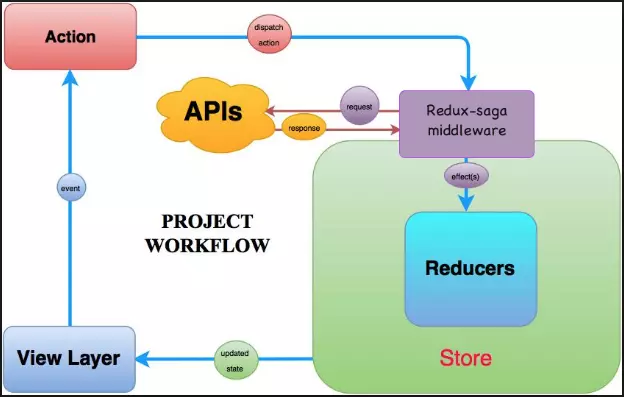

> **Redux-Saga** is a **middleware** for Redux that manages **complex asynchronous side effects** such as API calls, delays, retries, concurrency, and cancellation.

Redux-Saga uses **ES6 generator functions (`function*`)** because they allow:

* **Pausing and resuming execution** with `yield`
* Writing async logic in a **synchronous-looking** way
* Fine-grained control over **concurrency, cancellation, and sequencing**



## `call` and `put`

* **`call(fn, ...args)`**

  * Runs a function (usually an API call)
  * **Blocking**: the saga waits until it completes

* **`put(action)`**

  * Dispatches a Redux action

## `takeEvery` vs `takeLatest` vs `takeLeading`

* **`takeEvery`**

  * Runs a saga for **every action**
  * No cancellation

* **`takeLatest`**

  * Runs only the **latest action**
  * Cancels previous ones

* **`takeLeading`**

  * Runs only the **first action**
  * Ignores others until it finishes

## Multiple API Calls in Parallel

Use `yield all([...])`:

```js
yield all([
  call(fetchUser),
  call(fetchPosts),
  call(fetchComments),
])
```

All effects run **concurrently**, improving performance.

## Handle Errors

Use standard **`try/catch`** blocks inside sagas:

```js
try {
  const data = yield call(api)
  yield put(success(data))
} catch (error) {
  yield put(failure(error))
}
```

## Cancel a Running

* Automatically with **`takeLatest`**
* Manually using **`cancel(task)`**
* With `race`, when another effect finishes first

Cancellation is one of Redux-Saga’s strongest features.