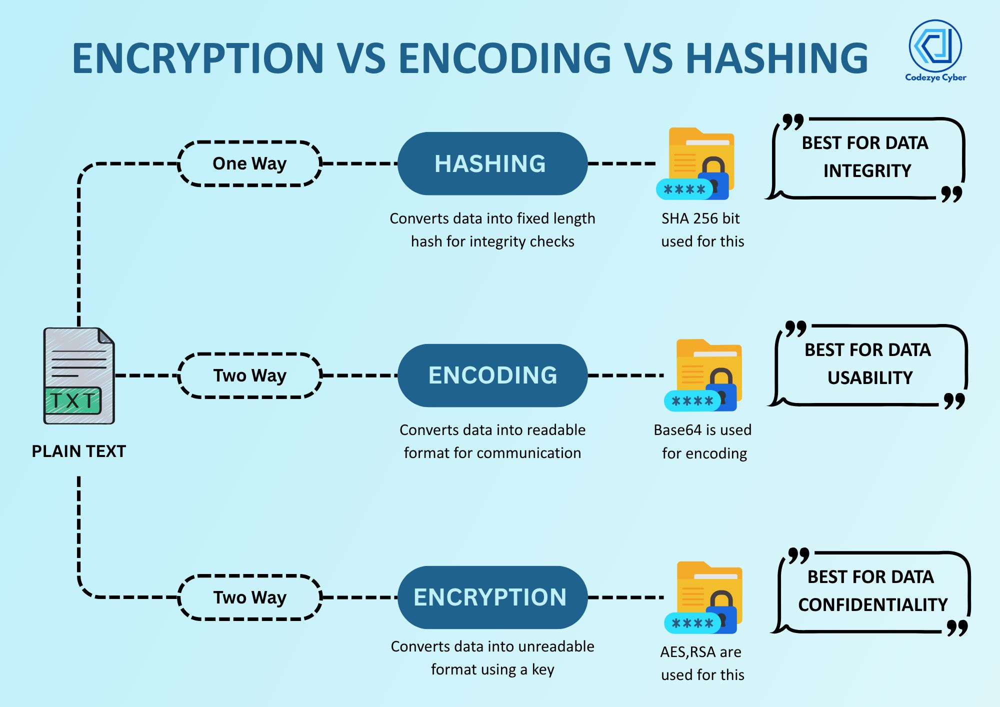

## Hashing vs Encoding vs Encryption



| Concept    | Real Example     | Goal                     |
| ---------- | ---------------- | ------------------------ |
| Hashing    | Password login   | Verify without revealing |
| Encoding   | Email attachment | Compatibility            |
| Encryption | HTTPS banking    | Confidentiality          |

### How to store passwords in Database securely?

> - **Hashing** is a one-way function that converts input data (like a password) into a fixed-size string of characters, which appears random. It is designed to be irreversible, meaning you cannot retrieve the original input from the hash.
> - **Encoding** is a reversible process that transforms data into a different format using a scheme that is publicly available. It is primarily used for data integrity and compatibility, not security.
> - **Encryption** is a two-way function that transforms data into a secure format using an algorithm and a key.

## TLS/SSL Handshake

SSL/TLS = Encryption + Authentication + Integrity for internet communication

> When a browser connects to an HTTPS website, it performs a TLS handshake to create a secure connection.     
>
> First, the browser and server agree on the TLS version and encryption algorithms.     
>
> The server then sends its SSL/TLS certificate, which contains its public key and is signed by a trusted Certificate Authority.      
>
> The browser verifies this certificate using built-in CA public keys to make sure the server is legitimate.      
>
> After that, the browser and server securely exchange key material and independently generate the same session key.      
>
> Once the handshake finishes, all further communication is encrypted using fast symmetric encryption like AES.     
>
> This ensures confidentiality, authentication, and data integrity for HTTPS traffic.     

### What happens when you type google.com and hit enter on browser? 

## CORS


**CORS (Cross-Origin Resource Sharing)** is a **browser security mechanism** that controls whether a web page can access resources from **another origin** (different domain, protocol, or port).

It exists to **relax the Same-Origin Policy safely**.

1. Browser sends request with:

   ```
   Origin: https://frontend.com
   ```
2. Server responds with headers like:

   ```
   Access-Control-Allow-Origin: https://frontend.com
   ```
3. Browser checks the headers

   * If allowed → response is accessible
   * If not → browser blocks it

> ⚠️ CORS is enforced by the **browser**, not the server.

### Why does CORS exist?

> CORS is a browser security mechanism that controls cross-origin HTTP requests.
>
> When a web app makes a request to a different origin, the browser adds an Origin header and checks the server’s CORS response headers.
>
> If the server allows the origin, the browser lets the response through; otherwise, it blocks it.
>
> For complex requests, the browser sends a preflight OPTIONS request first.
>
> CORS protects users while still allowing safe cross-domain communication.
