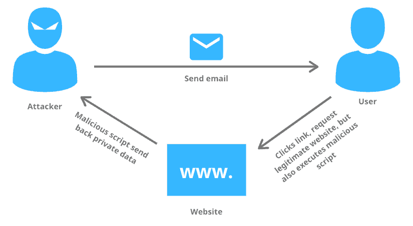
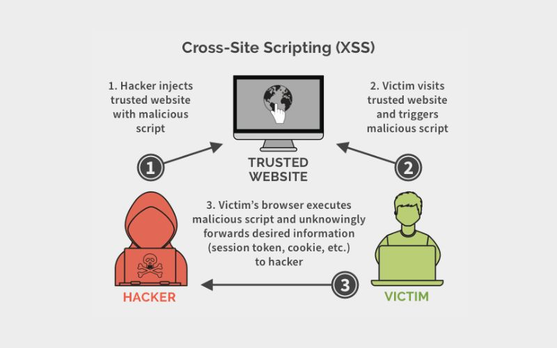

> **Cross-Site Scripting (XSS)** is a security vulnerability that allows attackers to inject and execute malicious code (usually JavaScript) in a legitimate website that users visit.

Because the browser treats this injected code as trusted content, attackers can:

* Steal cookies and session tokens
* Impersonate users
* Take over accounts

Unlike server-side attacks, XSS happens entirely in the **user’s browser**, making it harder to detect and block.

## How XSS Works

1. Attacker finds an input point (form, URL, comment, search field)
2. Injects malicious JavaScript
3. User visits the affected page
4. Browser executes the script
5. Attacker steals data or controls the session

Root cause:

* No input validation
* No output encoding

Attackers use XSS to:

* Steal cookies, tokens, and personal data
* Spread malware

## Common Types

### 1. Stored XSS (Persistent XSS)

The most dangerous type. Malicious code is stored permanently on the server.

**How it works:**

* Attacker submits a comment containing malicious code
* Server stores it in the database
* Every user who views the page runs the malicious script

### 2. Reflected XSS (Non-persistent XSS)

The most common type. The malicious code is embedded in a URL and reflected back to the user.

**How it works:**

* Attacker crafts a malicious link
* Victim clicks it
* The injected script runs in the browser

## Prevent

* Validate and filter all user input
* Use HttpOnly & Secure cookies
* Keep dependencies updated
* Train development teams
