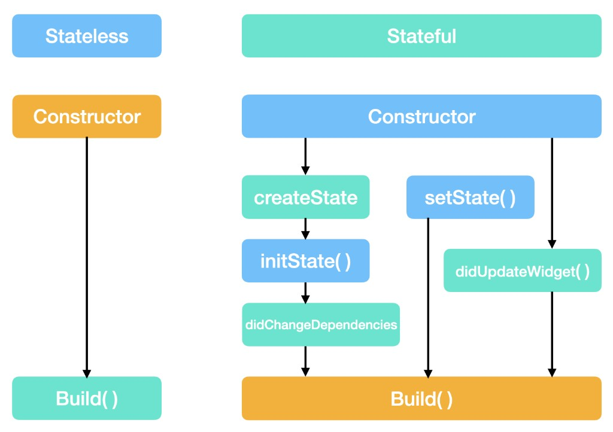

State is data that can change over time. When it changes, Flutter rebuilds the widgets that depend on it.

# 1. setState

Local state lives in a `State` object. `setState()` marks that object dirty so `build()` runs again.

```dart
class _CounterState extends State<Counter> {
  int count = 0;

  void increment() {
    setState(() {
      count++;
    });
  }

  @override
  Widget build(BuildContext context) {
    return ElevatedButton(
      onPressed: increment,
      child: Text("$count"),
    );
  }
}
```

Rules:

* Change the field **inside** `setState`, then Flutter rebuilds
* Only the widget that called `setState` rebuilds (plus its descendants)
* Use it for UI that belongs to one widget: a checkbox, a tab index, a form field

When several widgets need the same data, lift it up or use a `ChangeNotifier`.

# 2. ChangeNotifier

`ChangeNotifier` holds shared state and notifies listeners when it changes.

```dart
class CounterModel extends ChangeNotifier {
  int count = 0;

  void increment() {
    count++;
    notifyListeners();
  }
}
```

Create it once, dispose it when done, and listen from the UI:

```dart
final counter = CounterModel();

counter.addListener(() {
  print(counter.count);
});

counter.increment();
counter.dispose();
```

`notifyListeners()` is the equivalent of `setState` for objects that are not widgets.

Typical use:

* Pass the model into children
* Keep business data out of `State`
* Combine with `ListenableBuilder` so only the listening subtree rebuilds

# 3. ListenableBuilder

Rebuilds when a `Listenable` (including `ChangeNotifier`) calls `notifyListeners()`.

```dart
class CounterPage extends StatefulWidget {
  const CounterPage({super.key});

  @override
  State<CounterPage> createState() => _CounterPageState();
}

class _CounterPageState extends State<CounterPage> {
  final counter = CounterModel();

  @override
  void dispose() {
    counter.dispose();
    super.dispose();
  }

  @override
  Widget build(BuildContext context) {
    return ListenableBuilder(
      listenable: counter,
      builder: (context, child) {
        return Column(
          children: [
            Text("Count: ${counter.count}"),
            ElevatedButton(
              onPressed: counter.increment,
              child: const Text("Add"),
            ),
          ],
        );
      },
    );
  }
}
```

The optional `child` is built once and reused — put expensive widgets there if they do not depend on the listenable.

`ValueListenableBuilder` is the same idea for a `ValueNotifier<T>`.

# 4. Lifecycle



A `StatelessWidget` is Constructor → `build()`. A `StatefulWidget` has three paths into `build()`:

* first create → `createState` → `initState` → `didChangeDependencies` → `build`
* `setState` → `build`
* parent passed a new widget → `didUpdateWidget` → `build`

`State` objects have a lifecycle. These are the methods you use most:

```dart
class _ProfileState extends State<Profile> {
  late final TextEditingController controller;

  @override
  void initState() {
    super.initState();
    controller = TextEditingController();
    // subscribe, start animation, load once
  }

  @override
  void didChangeDependencies() {
    super.didChangeDependencies();
    // Theme.of(context), InheritedWidget — after initState and when they change
  }

  @override
  void didUpdateWidget(covariant Profile oldWidget) {
    super.didUpdateWidget(oldWidget);
    // parent passed new widget config (new props)
  }

  @override
  Widget build(BuildContext context) {
    return TextField(controller: controller);
  }

  @override
  void dispose() {
    controller.dispose();
    // cancel timers, close streams, dispose notifiers
    super.dispose();
  }
}
```

Order (simplified):

1. `initState` → created, no `context` inherited widgets yet
2. `didChangeDependencies` → first time, then when inherited data changes
3. `build` → as often as needed
4. `didUpdateWidget` → parent rebuilt this widget with a new configuration
5. `dispose` → removed forever; do not call `setState` after this

`setState` can run between `initState` and `dispose`. Create controllers and listeners in `initState`, tear them down in `dispose`.
