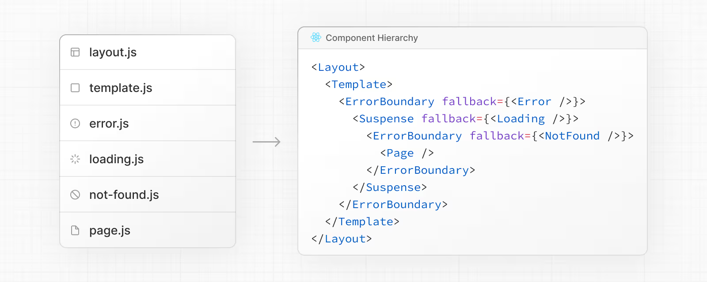

# Folder and file conventions

### Top-Level Folders

Top-level folders help organize your application code and static assets.

| Folder   | Purpose                                     |
| -------- | ------------------------------------------- |
| `app`    | App Router (modern routing system)          |
| `pages`  | Pages Router (legacy routing)               |
| `public` | Static assets (images, fonts, etc.)         |
| `src`    | Optional folder for application source code |

The `src` folder is optional but recommended for separating application logic from configuration files.

### Top-Level Files

These files configure and manage your project:

| File                 | Purpose                                    |
| -------------------- | ------------------------------------------ |
| `next.config.js`     | Next.js configuration                      |
| `package.json`       | Dependencies and scripts                   |
| `instrumentation.ts` | OpenTelemetry and instrumentation          |
| `proxy.ts`           | Request proxy                              |
| `.env*`              | Environment variables (not tracked in Git) |
| `eslint.config.mjs`  | ESLint configuration                       |
| `tsconfig.json`      | TypeScript configuration                   |
| `jsconfig.json`      | JavaScript configuration                   |
| `next-env.d.ts`      | Type declarations (not tracked)            |
| `.gitignore`         | Git ignore rules                           |

### Routing File Conventions

Next.js uses file-based routing. Special files define behavior within each route segment.

| File               | Purpose                             |
| ------------------ | ----------------------------------- |
| `layout.tsx`       | Shared layout (header, nav, footer) |
| `page.tsx`         | Public route page                   |
| `loading.tsx`      | Loading UI (Suspense boundary)      |
| `error.tsx`        | Error boundary                      |
| `global-error.tsx` | Global error UI                     |
| `not-found.tsx`    | 404 page                            |
| `route.ts`         | API endpoint                        |
| `template.tsx`     | Re-rendered layout                  |
| `default.tsx`      | Parallel route fallback             |

# Routes

### Nested Routes

Folders define URL segments. Nested folders create nested routes.

Example:

```
app/
 ├── layout.tsx
 ├── page.tsx
 └── blog/
     ├── layout.tsx
     ├── page.tsx
     └── authors/
         └── page.tsx
```

Resulting URLs:

* `/`
* `/blog`
* `/blog/authors`

A route becomes publicly accessible only when a `page.tsx` or `route.ts` file exists.

### Dynamic Routes

Dynamic routes use square brackets:

| Pattern       | Example URL             |
| ------------- | ----------------------- |
| `[slug]`      | `/blog/my-first-post`   |
| `[...slug]`   | `/shop/clothing/shirts` |
| `[[...slug]]` | Optional catch-all      |

Example:

```
app/blog/[slug]/page.tsx
```

Access parameters via:

```tsx
export default function Page({ params }) {
  return <div>{params.slug}</div>
}
```

### Route Groups

Wrap folder names in parentheses to organize routes **without affecting the URL**.

```
app/(marketing)/page.tsx → /
```

Useful for:

* Grouping marketing pages
* Sharing layouts
* Creating multiple root layouts

### Private Folders 

Prefix with underscore to exclude from routing:

```
app/blog/_components/Post.tsx
app/blog/_lib/data.ts
```

Useful for:

* UI utilities
* Helper functions
* Avoiding naming conflicts

# Metadata File Conventions

### App Icons

| File             | Purpose         |
| ---------------- | --------------- |
| `favicon.ico`    | Browser favicon |
| `icon.png`       | App icon        |
| `apple-icon.png` | Apple devices   |

### Open Graph & Social Images

| File                  | Purpose                   |
| --------------------- | ------------------------- |
| `opengraph-image.png` | Facebook/LinkedIn preview |
| `twitter-image.png`   | Twitter preview           |

### SEO Files

| File          | Purpose             |
| ------------- | ------------------- |
| `sitemap.xml` | Sitemap             |
| `robots.txt`  | Robots instructions |

These can also be dynamically generated using `.js` or `.ts`.

# Component Hierarchy

Special files render in this order:

```
layout
template
error
loading
not-found
page (or nested layout)
```

Each nested route inherits and wraps with parent layouts recursively.



### Colocation

You can safely place project files inside route segments without making them publicly accessible.

Only `page.tsx` or `route.ts` exposes content.

This means you can colocate:

* Components
* Utilities
* Hooks
* Styles

Inside the same route folder.


# Project Organization Strategies

Next.js is flexible. Choose what fits your team.

### Strategy 1: Feature-Based Structure (Recommended for Large Apps)


Shared logic stays at root.
Feature-specific logic stays inside route segments.

### Strategy 2: Advanced Layout Patterns

#### Multiple Root Layouts

Remove top-level `layout.tsx` and add layouts inside route groups:

```
app/(marketing)/layout.tsx
app/(shop)/layout.tsx
```

Each section gets its own `<html>` and `<body>`.

#### Opt-In Layouts

Move specific routes into a route group to apply a layout only to them.


#### Route-Specific Loading UI

Place `loading.tsx` inside a route group to limit skeleton UI to that segment only.
