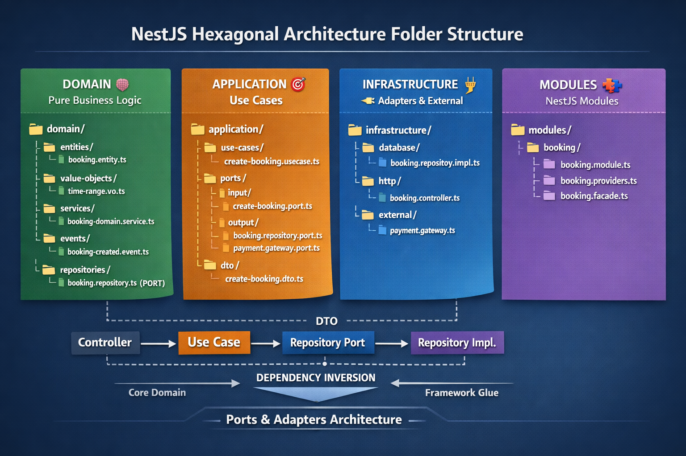

# What?

It separates your system into **core business logic** and **external world**. Hexagonal Architecture isn’t about folders. It’s about **protecting your business logic from chaos**.

👉 Your app should work **without NestJS, DB, or APIs**

Think:

* **Domain** → pure logic (no framework)
* **Application** → use cases
* **Ports** → interfaces
* **Adapters** → implementations
* **Infrastructure** → framework glue

# Recommended Folder Structure



```js
src/
│
├── domain/                          # Pure business logic (NO NestJS)
│   ├── entities/
│   │   └── booking.entity.ts
│   │
│   ├── value-objects/
│   │   └── time-range.vo.ts
│   │
│   ├── aggregates/
│   │   └── booking.aggregate.ts
│   │
│   ├── services/
│   │   └── booking-domain.service.ts
│   │
│   ├── events/
│   │   └── booking-created.event.ts
│   │
│   └── repositories/                # PORTS (interfaces)
│       └── booking.repository.ts
│
│
├── application/                     # Use cases (business flows)
│   ├── use-cases/
│   │   ├── create-booking.usecase.ts
│   │   ├── cancel-booking.usecase.ts
│   │   └── get-availability.usecase.ts
│   │
│   ├── dto/
│   │   └── create-booking.dto.ts
│   │
│   ├── ports/                      # INPUT/OUTPUT PORTS
│   │   ├── input/
│   │   │   └── create-booking.port.ts
│   │   └── output/
│   │       ├── booking.repository.port.ts
│   │       └── payment.gateway.port.ts
│   │
│   └── mappers/
│       └── booking.mapper.ts
│
│
├── infrastructure/                 # External world implementations
│   ├── database/
│   │   ├── prisma/
│   │   │   ├── prisma.service.ts
│   │   │   └── prisma.schema
│   │   │
│   │   └── repositories/          # ADAPTERS (implement ports)
│   │       └── booking.repository.impl.ts
│   │
│   ├── http/
│   │   ├── controllers/
│   │   │   └── booking.controller.ts
│   │   │
│   │   └── dto/
│   │       └── create-booking.request.ts
│   │
│   ├── messaging/
│   │   └── kafka.producer.ts
│   │
│   ├── external/
│   │   └── payment.gateway.ts
│   │
│   └── config/
│       └── env.config.ts
│
│
├── modules/                        # NestJS modules (composition root)
│   └── booking/
│       ├── booking.module.ts
│       ├── booking.providers.ts   # dependency injection bindings
│       └── booking.facade.ts      # optional orchestration layer
│
│
├── shared/                         # Cross-cutting concerns
│   ├── utils/
│   ├── constants/
│   ├── exceptions/
│   └── base/
│       └── entity.base.ts
│
│
├── main.ts                         # App bootstrap
└── app.module.ts
```

# Explained (Step-by-Step)

> Request hits controller → controller calls use case → use case executes business logic via domain → interacts with repository interfaces → infrastructure provides implementations (DB/API).
> This keeps business logic independent from frameworks.

## 1. Request → Controller

👉 A user (or frontend) sends a request.    
👉 Controller in NestJS receives it

Example:

```http
POST /bookings
```

```js
@Post()
create(@Body() body: CreateBookingRequest) {
  return this.useCase.execute(body);
}
```

**What controller does:** Validate input, Call use case, Return response, No business logic here.

## 2. Controller → Use Case (Application layer)

👉 This is the **brain of the flow**.    
👉 Think: “What should happen when user books?”

```ts
execute(dto: CreateBookingDto) {
  // orchestrate everything
}
```

**What use case does:** Coordinates steps, Calls domain logic, Calls repository (interface) 

## 3. Use Case → Domain (Business rules)

👉 Domain decides **what is valid or not**.    
👉 Think: “Is this booking valid?”

```ts
if (booking.conflictsWith(existing)) {
  throw new Error('Conflict');
}
```

**What domain does:** Contains rules, Validates logic,  No DB / no framework

## 4. Use Case → Repository (Interface / Port)

👉 Use case doesn’t know DB → it uses an **interface**.    
👉 Think: “I need data, but I don’t care how”

```ts
this.bookingRepo.save(booking);
```

**Important:** This is just a contract. No implementation here

## 5. Infrastructure (Implementation)

👉 Real implementation lives here.    
👉 Think: “How do we actually do it?”

```ts
@Injectable()
export class BookingRepositoryImpl implements BookingRepository {
  async save(booking: Booking) {
    return this.prisma.booking.create(...);
  }
}
```

**What infrastructure does:** DB queries (Prisma), API calls (payment, email), External systems


