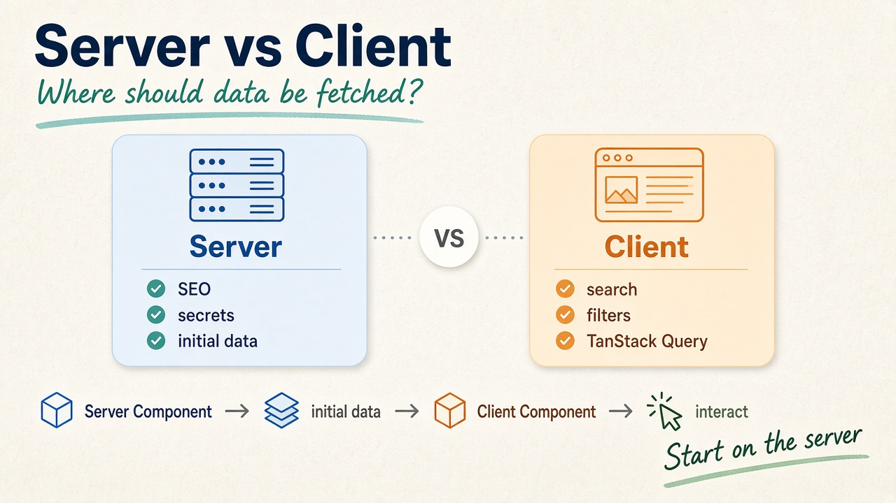

Data fetching in Next.js 16 mainly comes down to one question: **should this data be fetched on the Server or the Client?**

With the App Router, Server Components are the default. This means you can fetch data directly inside an async component without `useEffect` or an additional API layer.



## Server-side Data Fetching

A Server Component can fetch data directly:

```tsx
async function getPosts() {
  const res = await fetch("https://api.example.com/posts")

  if (!res.ok) {
    throw new Error("Failed to fetch posts")
  }

  return res.json()
}

export default async function BlogPage() {
  const posts = await getPosts()

  return (
    <div>
      {posts.map((post: any) => ())}
    </div>
  )
}
```

## Caching and Revalidation

Next.js 16 also provides mechanisms for controlling how fetched data is cached and revalidated. For example, you can revalidate data every 60 seconds:

```tsx
const res = await fetch("https://api.example.com/posts", {
  next: {
    revalidate: 60,
  },
})
```

For data that should be fetched without using the Data Cache:

```tsx
const res = await fetch("https://api.example.com/posts", {
  cache: "no-store",
})
```

The important idea is that with the App Router, you don't need to think in terms of `getStaticProps` or `getServerSideProps` for new applications. Data fetching is built directly into Server Components and the rendering model.

## Client-side Data Fetching

Client-side fetching is useful when data depends on user interaction or browser state. Add `"use client"` to make a component a Client Component:

```tsx
"use client"

import { useEffect, useState } from "react"

export default function Posts() {
  const [posts, setPosts] = useState([])

  useEffect(() => {
    fetch("/api/posts")
      .then((res) => res.json())
      .then(setPosts)
  }, [])

  return (
    <div>
      {posts.map((post: any) => (
        <article key={post.id}>
          {post.title}
        </article>
      ))}
    </div>
  )
}
```

This approach works for things like search, filters, infinite scrolling, user-specific data, and other interactions that happen directly in the browser.

## Using TanStack Query

For applications with more complex client-side data requirements, **TanStack Query (React Query)** provides a better way to manage server state. It handles caching, background refetching, loading and error states, query invalidation, mutations, and more.

Install it with:

```bash
npm install @tanstack/react-query
```

A Client Component can then use `useQuery`:

```tsx
"use client"

import { useQuery } from "@tanstack/react-query"

async function getPosts() {
  const res = await fetch("/api/posts")

  if (!res.ok) {
    throw new Error("Failed to fetch posts")
  }

  return res.json()
}

export default function Posts() {
  const { data, error, isPending } = useQuery({
    queryKey: ["posts"],
    queryFn: getPosts,
  })

  return (
    <div>
      {data.map((post: any) => ())}
    </div>
  )
}
```