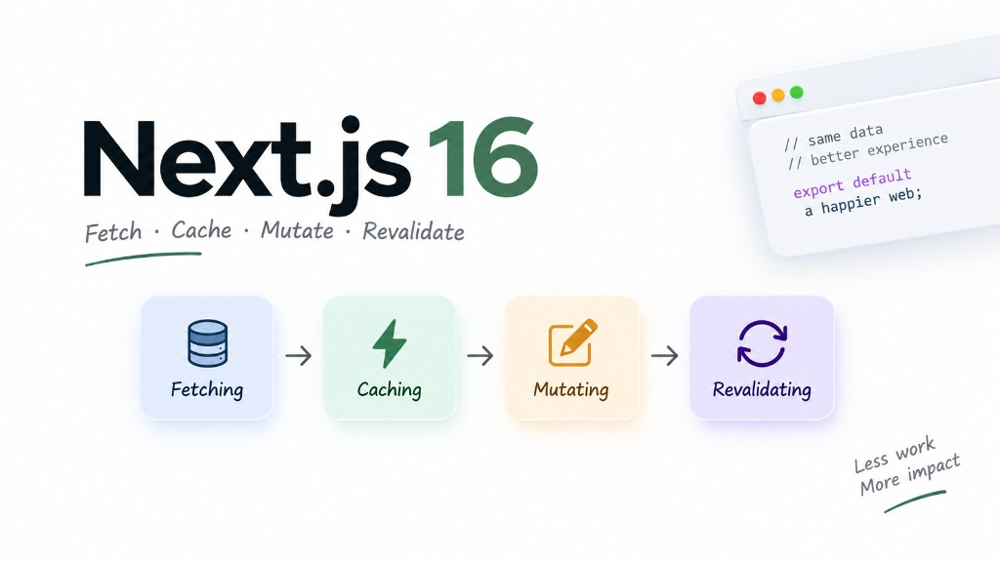

When learning the Next.js App Router, there are four concepts that can easily get mixed up: **Fetching Data, Mutating Data, Caching, and Revalidating**. They sound like four completely different things, but in a real application they are really just parts of the same flow: **get data → show data → change data → refresh data**.



## 1. Fetching Data — Getting the data

Imagine our `/plants` page needs to display all plants from the database. With a Server Component, we can fetch from an API

```tsx
export default async function PlantsPage() {
  const res = await fetch("https://api.example.com/plants")
  const plants = await res.json()

  return <PlantList plants={plants} />
}
```

## 2. Caching — Why keep the result?

Let’s say our plant catalog doesn’t change every few seconds. If 100 people open `/plants`, we probably don’t want to run the same database query 100 times for no reason.

That’s where caching comes in. With **Cache Components**, we can cache the function that gets our plants:

```tsx
export async function getPlants() {
  "use cache"

  return db.plant.findMany()
}
```

Now Next.js can reuse the cached result instead of doing the same work again every time.

## 3. Mutating Data — Changing the data

Fetching is about **reading** data. Mutation is about **changing** it.

For example, an admin creates a new plant:

```tsx
"use server"

export async function createPlant(formData: FormData) {
  const name = formData.get("name")

  await db.plant.create({
    data: {
      name: name as string,
    },
  })
}
```

Then we can use that action from a form:

```tsx
<form action={createPlant}>
  <input name="name" />
  <button>Create Plant</button>
</form>
```

This is where Server Functions / Server Actions become really convenient. You don’t always need to build a separate API route just to handle a simple form submission.


## 4. The problem: the cache may now be outdated

Let’s use a simple plant shop as an example.

Suppose our database initially contains:

```text
Monstera
Philodendron
Snake Plant
```

We cache that list. Then an admin adds:

```text
Ficus
```

The database is now up to date, but the cached result may still look like this:

```text
Monstera
Philodendron
Snake Plant
```

So the user may still see old data.

We need to tell Next.js:

> “This cached data is outdated. Refresh it.”

That is basically what **revalidation** is about.

## summary

| API / Function     | Purpose                                 | When to use                                   | Quick example                    |
| ------------------ | --------------------------------------- | --------------------------------------------- | -------------------------------- |
| `fetch()`          | Fetch data from API                     | Get data from an external API                 | `await fetch(url)`               |
| `Promise.all()`    | Fetch multiple sources in parallel      | Avoid sequential requests                     | `await Promise.all([a(), b()])`  |
| `use cache`        | Mark a function/component as cacheable  | Cache data or rendered output                 | `'use cache'`                    |
| `cacheLife()`      | Define how long cached data stays valid | Time-based revalidation                       | `cacheLife('hours')`             |
| `cacheTag()`       | Attach a tag to cached data             | Invalidate related data later                 | `cacheTag('plants')`             |
| `updateTag()`      | Immediately expire a cache tag          | User should see their own changes immediately | `updateTag('plants')`            |
| `revalidateTag()`  | Revalidate data by tag                  | Refresh shared cached data                    | `revalidateTag('plants', 'max')` |
| `revalidatePath()` | Revalidate a specific route             | A particular page needs fresh data            | `revalidatePath('/plants')`      |
| `redirect()`       | Redirect after a mutation               | Create/update then go to another page         | `redirect('/plants')`            |
| `refresh()`        | Refresh the client router               | Refresh UI from current route                 | `refresh()`                      |
