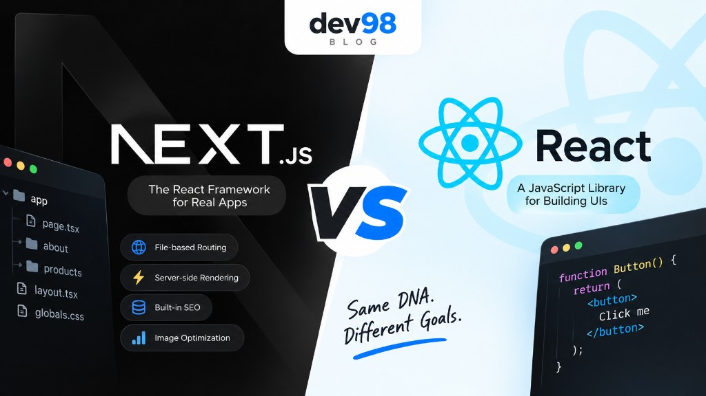

If you're learning React, you may soon hear about **Next.js**. They are related, but they are not the same thing.



The simple way to remember it:

> **React is a library for building UI. Next.js is a framework built on React.**

Let's look at the difference in a simple way.

## 1. What is React?

**React** is a JavaScript library created by Meta for building user interfaces.

With React, you build your application using reusable **components**:

```jsx
function Button() {
  return <button>Click me</button>;
}
```

React focuses mainly on the UI. For things like routing, data fetching, or state management, you usually add other libraries such as React Router or Redux.

React is a good fit when you want **flexibility and control** over your application.

## 2. What is Next.js?

**Next.js** is a framework built on top of React.

It gives you many features that React does not provide by itself, such as:

* File-based routing
* Server-side rendering (SSR)
* Static generation
* Server Components
* Data fetching
* Image optimization
* Built-in SEO support

For example, creating:

```text
app/
├── page.tsx
├── about/
│   └── page.tsx
└── products/
    └── page.tsx
```

automatically gives you routes like:

```text
/
/about
/products
```

So you can build a complete web application without adding as many extra tools.

## 3. React vs Next.js

The biggest difference is how much each one provides.

|                  | React                  | Next.js          |
| ---------------- | ---------------------- | ---------------- |
| Type             | Library                | Framework        |
| UI Components    | ✅                      | ✅                |
| Routing          | Add a library          | Built-in         |
| Server Rendering | Extra setup            | Built-in         |
| SEO              | More work              | Easier           |
| Data Fetching    | Client-side by default | Server + Client  |
| Flexibility      | High                   | More conventions |

Think of it this way:

**Next.js gives you the building blocks + a structure for building the whole application.**

## 4. When Should You Use React?

React can be a good choice when:

* You are building a client-side application.
* You want maximum flexibility.
* You already have your own backend and routing setup.
* You want to choose your own tools.

For example, a dashboard that mainly runs inside the browser can work very well with React.

## 5. When Should You Use Next.js?

Next.js is useful when you need things like:

* SEO-friendly pages
* Fast initial page loads
* Server-side rendering
* Static pages
* Built-in routing
* Full-stack React applications

For example, **blogs, e-commerce websites, company websites, and content-heavy websites** can benefit from Next.js.