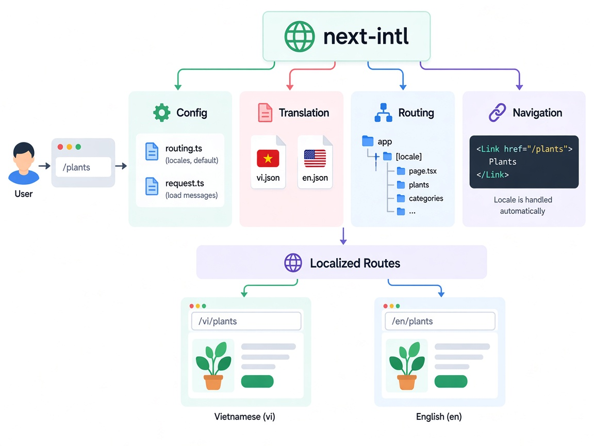

Supporting multiple languages in Next.js can become complicated when you manage routing, translations, and navigation yourself.

`next-intl` helps simplify this process.



## 1. Install

```bash
npm install next-intl
```

---

## 2. Create Translation Files

Create one JSON file for each language:

```text
messages/
├── en.json
└── vi.json
```

**en.json**

```json
{
  "Home": {
    "title": "Welcome to Green Garden"
  }
}
```

**vi.json**

```json
{
  "Home": {
    "title": "Chào mừng đến Green Garden"
  }
}
```

---

## 3. Config

Define the supported locales and the default locale.

```ts
// src/i18n/routing.ts

export const routing = defineRouting({
  locales: ["en", "vi"],
  defaultLocale: "vi",
});
```

Now `next-intl` knows:

```text
Locales: en, vi
Default: vi
```

---

## 4. Request Config

Load the correct translation file based on the current locale.

```ts
// src/i18n/request.ts

export default getRequestConfig(async ({ requestLocale }) => {
  const locale = await requestLocale;

  return {
    locale,
    messages: (
      await import(`../../messages/${locale}.json`)
    ).default,
  };
});
```

For example:

```text
/vi
 ↓
locale = vi
 ↓
messages/vi.json
```

---

## 5. Use Translations

In a component:

```tsx
import { useTranslations } from "next-intl";

export default function HomePage() {
  const t = useTranslations("Home");

  return <h1>{t("title")}</h1>;
}
```

With `vi`:

```text
Chào mừng đến Green Garden
```

With `en`:

```text
Welcome to Green Garden
```

---

## 6. Locale Routing

Use `[locale]` in the App Router:

```text
app/
└── [locale]/
    ├── page.tsx
    ├── plants/
    │   └── page.tsx
    └── categories/
        └── page.tsx
```

This gives you:

```text
/vi/plants
/en/plants

/vi/categories
/en/categories
```

---

## 7. Navigation

`next-intl` can provide locale-aware navigation.

```tsx
import { Link } from "@/i18n/navigation";

<Link href="/plants">
  Plants
</Link>
```

The locale is handled automatically:

```text
/vi/plants
/en/plants
```

You don't need to manually write:

```tsx
`/${locale}/plants`
```
