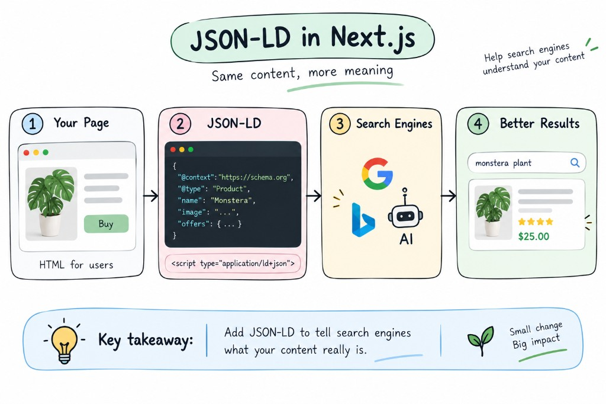

## 1. What is JSON-LD?

**JSON-LD** stands for **JSON for Linked Data**.

It is a format for adding **structured data** to a webpage so search engines and other systems can better understand the content.

For example, a normal HTML page might contain:

```html
<h1>Monstera Thai Constellation</h1>
<p>Beautiful variegated plant.</p>
```

To a user, this is obviously a product.

With JSON-LD, we can explicitly describe it as a `Product`:

```json
{
  "@context": "https://schema.org",
  "@type": "Product",
  "name": "Monstera Thai Constellation",
  "description": "Beautiful variegated plant."
}
```

**When to use:**
Use JSON-LD when you want to provide structured information about entities such as products, organizations, articles, events, recipes, and more.

---

## 2. `@context`

`@context` tells the parser which vocabulary you're using.

Most websites use Schema.org:

```json
{
  "@context": "https://schema.org"
}
```

Think of it as:

```text
@context
   ↓
"What vocabulary do these properties belong to?"
```

---

## 3. `@type`

`@type` tells search engines what the entity is.

```json
{
  "@context": "https://schema.org",
  "@type": "Product"
}
```

This means:

> This data describes a Product.

Common types include:

```text
Product
Organization
WebSite
Article
Person
Event
Recipe
Book
BreadcrumbList
```

For example:

```json
{
  "@context": "https://schema.org",
  "@type": "Organization",
  "name": "Green Garden"
}
```

---

## 4. Properties

After defining the type, we provide information about that entity.

```json
{
  "@context": "https://schema.org",
  "@type": "Product",
  "name": "Monstera Thai Constellation",
  "description": "A beautiful variegated Monstera.",
  "image": "https://example.com/monstera.jpg"
}
```

Here:

```text
@type       → Product
name        → Product name
description → Product description
image       → Product image
```

Each Schema.org type has its own supported properties.
