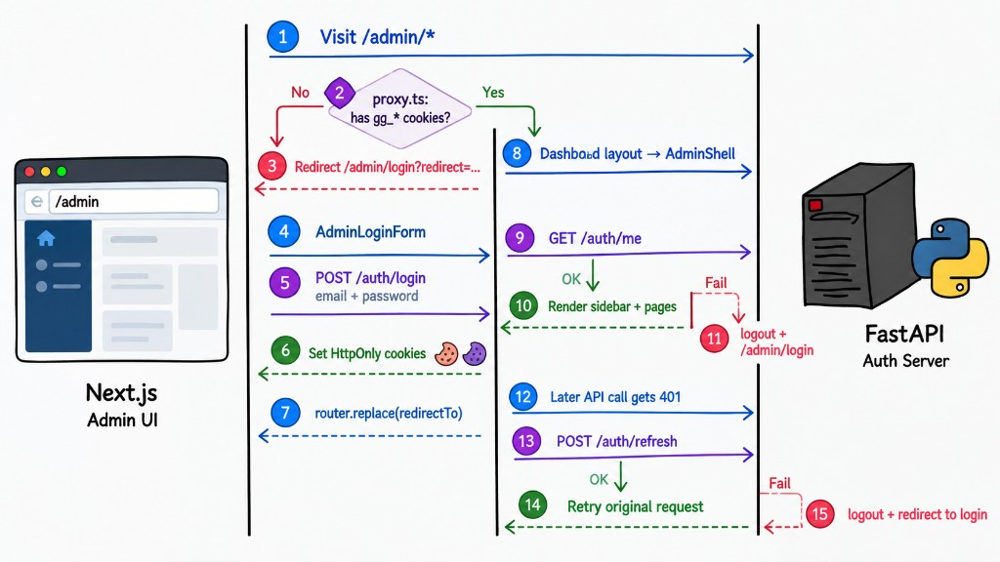

JWT authentication can look complicated when you see all the requests, redirects, cookies, and refresh logic together. The easiest way to understand this architecture is to look at what happens in each common situation: **login, already logged in, fake login, token expiration, and logout**.

## 1. Login

When an unauthenticated user visits `/admin`, `proxy.ts` checks for the authentication cookies. Since they do not exist, the user is redirected to `/admin/login`.

The login form then sends the email and password to FastAPI through `POST /auth/login`. The backend validates the credentials and, if they are correct, creates the access and refresh JWTs. Instead of returning the tokens to JavaScript, FastAPI stores them as **HttpOnly cookies**:

* `gg_access_token` — short-lived JWT used to authorize API requests
* `gg_refresh_token` — longer-lived JWT used to get a new access token when the current one expires

This is important because the frontend does not need to manage the JWT itself. The browser automatically sends the cookies with API requests.

## 2. Already Logged In

If the user already has authentication cookies and visits `/admin`, `proxy.ts` sees the cookies and allows the request to continue.

However, having a cookie does **not** mean the user is authenticated. The cookie could be expired or invalid. That's why the dashboard still calls `/auth/me`.

FastAPI validates the JWT and returns the current admin if everything is valid. Only then does the application render the admin pages.

## 3. Access Token Expires

Access tokens should normally have a relatively short lifetime. When an admin makes an API request after the access token has expired, FastAPI returns `401 Unauthorized`.

The API client then tries `POST /auth/refresh`. If the refresh token is still valid, FastAPI issues a new access token and the client retries the original request. The user can continue working without seeing the login page.

## 4. Logout

Logout is handled by the backend through `POST /auth/logout`. FastAPI clears the authentication cookies, while the frontend clears the current admin state and redirects to the login page.

After that, accessing `/admin` starts the authentication process again because there are no valid session cookies.