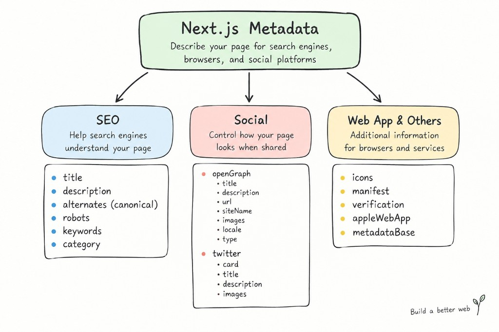

Metadata provides information about a web page for search engines, browsers, and social platforms.

In Next.js, you can define metadata using the `Metadata` API in `layout.tsx` or `page.tsx`. For dynamic pages, you can use `generateMetadata()`.



Here is a practical example containing many commonly used fields:

```tsx
import type { Metadata } from "next";

export const metadata: Metadata = {
  metadataBase: new URL("https://greengarden.com"),

  title: {
    default: "Green Garden",
    template: "%s | Green Garden",
  },

  description:
    "Discover beautiful plants, gardening tips, and tropical plant guides.",

  keywords: [
    "plants",
    "indoor plants",
    "Monstera",
    "gardening",
  ],

  alternates: {
    canonical: "/",
    languages: {
      en: "/en",
      vi: "/vi",
    },
  },

  robots: {
    index: true,
    follow: true,
  },

  openGraph: {
    title: "Green Garden",
    description:
      "Discover beautiful plants and gardening guides.",
    url: "/",
    siteName: "Green Garden",
    images: [
      {
        url: "/images/og-image.jpg",
        width: 1200,
        height: 630,
        alt: "Green Garden",
      },
    ],
    locale: "en_US",
    type: "website",
  },

  twitter: {
    card: "summary_large_image",
    title: "Green Garden",
    description:
      "Discover beautiful plants and gardening guides.",
    images: ["/images/og-image.jpg"],
  },

  icons: {
    icon: "/favicon.ico",
    apple: "/apple-icon.png",
  },

  manifest: "/manifest.webmanifest",

  verification: {
    google: "your-google-verification-code",
  },

  appleWebApp: {
    capable: true,
    title: "Green Garden",
    statusBarStyle: "default",
  },

  category: "gardening",
};
```

> This example is intentionally broad. In a real project, you only need the fields that are relevant to your website.

---

# Common Metadata Fields

## `metadataBase`

Defines the **base URL** used to resolve relative URLs.

```tsx
metadataBase: new URL("https://greengarden.com"),
```

For example:

```text
/images/og-image.jpg
```

can be resolved against:

```text
https://greengarden.com/images/og-image.jpg
```

---

## `title`

Defines the **page title**.

```tsx
title: "Plants",
```

It can also use `default` and `template`:

```tsx
title: {
  default: "Green Garden",
  template: "%s | Green Garden",
},
```

`default` is used when a child page does not define its own title. `template` provides a common format for child pages.

---

## `description`

Provides a short **description of the page**.

```tsx
description:
  "Discover beautiful plants and gardening guides.",
```

It helps describe the content of the page to search engines and other consumers of metadata.

---

## `keywords`

Defines a list of **keywords associated with the page**.

```tsx
keywords: [
  "plants",
  "Monstera",
  "gardening",
],
```

It is optional and generally not something you need to prioritize.

---

## `alternates`

Defines **alternative URLs** related to the page.

```tsx
alternates: {
  canonical: "/plants",

  languages: {
    en: "/en/plants",
    vi: "/vi/plants",
  },
},
```

Common uses:

```text
canonical → main URL
languages → localized URLs
```

Next.js also supports `media` and `types` under `alternates`.

---

## `robots`

Controls instructions for **search engine crawlers**.

```tsx
robots: {
  index: true,
  follow: true,
},
```

For example, a private page could use:

```tsx
robots: {
  index: false,
  follow: false,
},
```

---

## `openGraph`

Defines information used when the page is **shared on social platforms**.

```tsx
openGraph: {
  title: "Green Garden",
  description: "Discover beautiful plants.",
  url: "/",
  siteName: "Green Garden",
  images: ["/images/og-image.jpg"],
  type: "website",
},
```

Common fields include:

```text
title
description
url
siteName
images
locale
type
```

---

## `twitter`

Defines metadata for **Twitter/X link previews**.

```tsx
twitter: {
  card: "summary_large_image",
  title: "Green Garden",
  description: "Discover beautiful plants.",
  images: ["/images/og-image.jpg"],
},
```

Common fields include:

```text
card
title
description
images
```

---

## `icons`

Defines **website icons**, such as favicon and Apple icons.

```tsx
icons: {
  icon: "/favicon.ico",
  apple: "/apple-icon.png",
},
```

---

## `manifest`

Defines the URL of the **Web App Manifest**.

```tsx
manifest: "/manifest.webmanifest",
```

The manifest contains information about the web application, such as its name, icons, and how it should be launched.

---

## `verification`

Provides verification information for external services.

```tsx
verification: {
  google: "your-google-verification-code",
},
```

This can be used for services such as website ownership verification.

---

## `appleWebApp`

Configures how the website behaves as an **Apple Web App**.

```tsx
appleWebApp: {
  capable: true,
  title: "Green Garden",
  statusBarStyle: "default",
},
```

This is mainly relevant when supporting a web-app-like experience on Apple devices.

---

## `category`

Defines the **category of the document/site**.

```tsx
category: "gardening",
```

For a plant shop, a value such as `gardening` can describe the site's general category.
