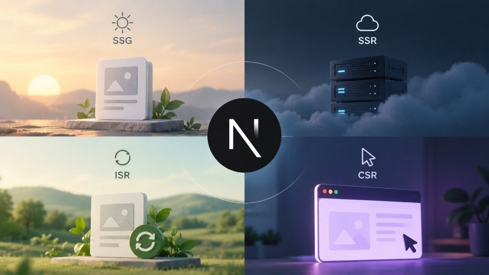

One of the most important things to understand in Next.js is **where and when your page gets rendered**. There are four common rendering strategies: **Static Site Generation (SSG), Server-Side Rendering (SSR), Incremental Static Regeneration (ISR), and Client-Side Rendering (CSR).**



## Static Site Generation (SSG)

With **SSG**, the page is generated ahead of time and served as static HTML.

```text
Build time → Generate HTML → User request → Serve HTML
```

SSG works well for content that doesn't change frequently, such as blog posts, documentation, landing pages, and product pages.

For dynamic routes, App Router provides `generateStaticParams()`:

```tsx
export async function generateStaticParams() {
  const posts = await getPosts()

  return posts.map((post) => ({
    slug: post.slug,
  }))
}
```

Next.js can then pre-render routes such as `/blog/nextjs-routing` and `/blog/react-server-components`.

## Server-Side Rendering (SSR)

With **SSR**, the page is rendered on the server when a request arrives.

```text
User request → Server → Fetch data → Render HTML → Response
```

SSR is useful when content needs to be generated from fresh or request-specific data, such as personalized pages, frequently changing content, or request-dependent pages.

Unlike SSG, the page isn't generated ahead of time. The server generates it when the request comes in.

## Incremental Static Regeneration (ISR)

If you have a large number of pages but don't need to update them on every request, **ISR** can be useful. It allows static content to be revalidated and regenerated without rebuilding the entire application.

```tsx
export const revalidate = 3600
```

The basic idea is:

```text
Static page → Serve cached version → Revalidate → Updated version
```

ISR works well for large product catalogs, blogs, news sites, and other content that changes periodically.

## Client-Side Rendering (CSR)

With **CSR**, data fetching and rendering happen primarily in the browser.

```tsx
"use client"

useEffect(() => {
  fetch("/api/products")
    .then((res) => res.json())
    .then(setProducts)
}, [])
```

CSR is useful for highly interactive or private areas such as dashboards, account pages, admin interfaces, and complex client-side interactions.

For SEO-focused pages, relying entirely on CSR can be less ideal because important content may not be available in the initial HTML.

## SSG vs SSR vs ISR vs CSR

| Strategy | When it renders       | Good for                         |
| -------- | --------------------- | -------------------------------- |
| **SSG**  | Ahead of time         | Stable content                   |
| **SSR**  | On each request       | Fresh/request-specific content   |
| **ISR**  | Static + revalidation | Periodically changing content    |
| **CSR**  | In the browser        | Interactive/private applications |