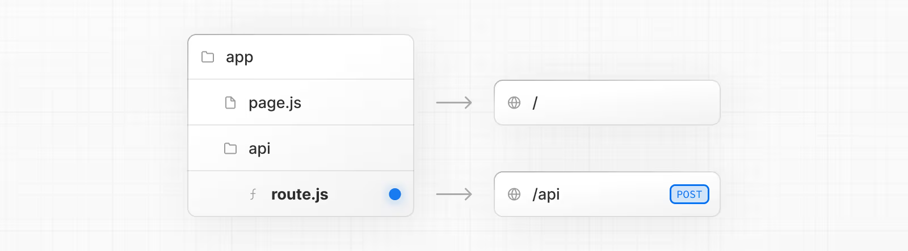

> **Route Handlers** in Next.js allow you to build backend endpoints directly inside the **App Router** using the standard **Web Request and Response APIs**. They are the App Router equivalent of **API Routes** in the `pages` directory.

### Route Handler

Route Handlers are created using a special file named **`route.ts`** (or `route.js`) inside the `app` directory.



```ts
// app/api/route.ts
export async function GET(request: Request) {
  return Response.json({ message: "Hello from API" })
}
```

### Supported HTTP Methods

Route Handlers support standard HTTP verbs:

* `GET`
* `POST`
* `PUT`
* `PATCH`
* `DELETE`
* `HEAD`
* `OPTIONS`

Example:

```ts
export async function POST(request: Request) {
  const body = await request.json()
  return Response.json({ received: body })
}
```

If an unsupported method is used, Next.js automatically returns **405 Method Not Allowed**.

### NextRequest and NextResponse

Next.js extends the native APIs with:

* `NextRequest`
* `NextResponse`

These provide extra utilities for working with cookies, headers, and middleware.

Example:

```ts
import { NextRequest, NextResponse } from "next/server"

export async function GET(req: NextRequest) {
  const userAgent = req.headers.get("user-agent")
  return NextResponse.json({ userAgent })
}
```

### Caching Behavior

By default, **Route Handlers are not cached**.

Only **GET requests** can opt into caching.

Example:

```ts
export const dynamic = "force-static"

export async function GET() {
  const data = await fetch("https://api.example.com/data")
  const json = await data.json()

  return Response.json(json)
}
```

Notes:

* Only **GET** can be cached
* `POST`, `PUT`, `PATCH`, `DELETE` are **never cached**

### Using Cache Components

You can cache dynamic data using **`use cache`** in helper functions.

```ts
import { cacheLife } from "next/cache"

export async function GET() {
  const products = await getProducts()
  return Response.json(products)
}

async function getProducts() {
  "use cache"
  cacheLife("hours")

  return db.query("SELECT * FROM products")
}
```

Important:

* `use cache` **cannot be used directly inside the Route Handler**.    
* Must be placed inside a helper function

### Type-Safe Route Context 

Next.js provides a **RouteContext helper** to type route parameters.

Example:

```ts
import type { NextRequest } from "next/server"

export async function GET(
  req: NextRequest,
  ctx: RouteContext<"/users/[id]">
) {
  const { id } = await ctx.params
  return Response.json({ id })
}
```