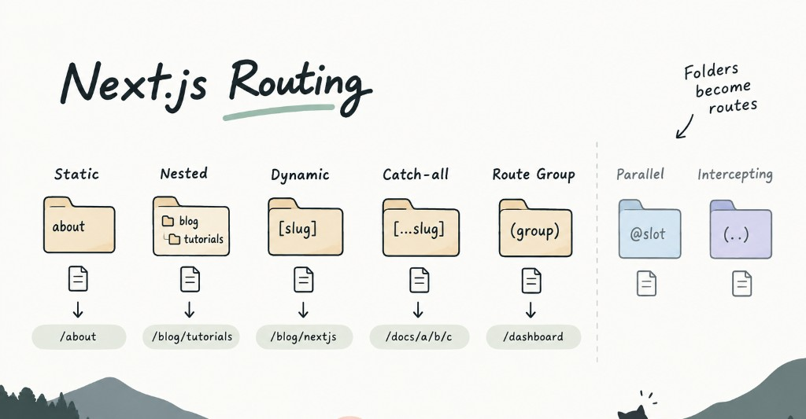

Next.js App Router uses your folder structure to create routes. No separate router config needed.



## 1. Static Routes

The simplest one.

```text
app/
├── page.tsx
├── about/
│   └── page.tsx
└── contact/
    └── page.tsx
```

This gives you:

```text
/
/about
/contact
```

---

## 2. Nested Routes

Folders can be nested to create deeper URLs.

```text
app/
└── blog/
    └── tutorials/
        └── page.tsx
```

→ `/blog/tutorials`

---

## 3. Dynamic Routes `[slug]`

This is probably the one you’ll use the most.

```text
app/
└── blog/
    └── [slug]/
        └── page.tsx
```

`slug` is the dynamic part of the URL. You can read it from `params`:

```tsx
export default async function Page({params,}: {params: Promise<{ slug: string }>}) {
  const { slug } = await params

  return <h1>{slug}</h1>
}
```

For `/blog/nextjs`, `slug` is `"nextjs"`.

---

## 4. Catch-all Routes `[...slug]`

Sometimes you need to match multiple URL segments.

```text
app/
└── docs/
    └── [...slug]/
        └── page.tsx
```

Think of it as:

```text
[slug]       → one segment
[...slug]    → one or more segments
```

Useful for documentation, CMS pages, or deep category structures.

---

## 5. Route Groups `(group)`

Route Groups are mainly for organizing your app.

```text
app/
├── (marketing)/
│   ├── about/
│   └── pricing/
└── (dashboard)/
    └── dashboard/
```

The `(marketing)` and `(dashboard)` parts **don't appear in the URL**.

They’re useful when you want different layouts or want to keep a large project organized.

---

## And There Are More...

Next.js also has some more advanced routing patterns:

| Pattern             | Syntax        | Use case                                |
| ------------------- | ------------- | --------------------------------------- |
| Parallel Routes     | `@slot`       | Render multiple UI sections in parallel |
| Intercepting Routes | `(.)`, `(..)` | Intercept a route, commonly for modals  |

You probably don't need these on day one.