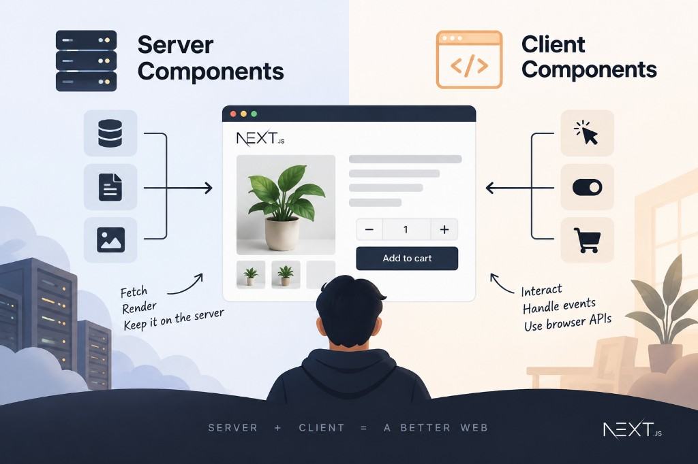

One of the most important concepts in the Next.js App Router is understanding when to use Server Components and Client Components. The simple rule is: **Server Components are for data and rendering, while Client Components are for interaction.**



## Server Components

In the App Router, components are Server Components by default. This makes them a good place to fetch data, query a database, access server-only resources, and render content for SEO.

```tsx
export default async function ProductPage() {
  const product = await getProduct()

  return (
    <div>
      <h1>{product.name}</h1>
      <p>{product.description}</p>
    </div>
  )
}
```

## Client Components

When a component needs interaction, add `"use client"` at the top.

```tsx
"use client"

import { useState } from "react"

export default function Counter() {
  const [count, setCount] = useState(0)

  return (
    <button onClick={() => setCount(count + 1)}>
      Count: {count}
    </button>
  )
}
```

Use Client Components when you need things like `useState`, `useEffect`, event handlers such as `onClick`, or browser APIs such as `localStorage` and `window`.

## Use Them Together

Most real applications use both. For example, a product page can fetch the product on the server while keeping the Add to Cart button interactive on the client.

So the structure becomes:

```text
ProductPage        Server
├── Product info   Server
└── AddToCart      Client
```

```tsx
export default async function ProductPage() {
  const product = await getProduct()

  return (
    <>
      <h1>{product.name}</h1>
      <AddToCart productId={product.id} />
    </>
  )
}
```

```tsx
"use client"

export default function AddToCart({ productId }) {
  function handleClick() {
    // Add to cart
  }

  return <button onClick={handleClick}>Add to cart</button>
}
```

## Can a Client Component contain a Server Component?

Yes, but don't directly import a Server Component into a Client Component. A common pattern is to pass the Server Component through `children`.

```tsx
"use client"

export default function Modal({ children }) {
  return <div>{children}</div>
}
```

children is Server Component
```