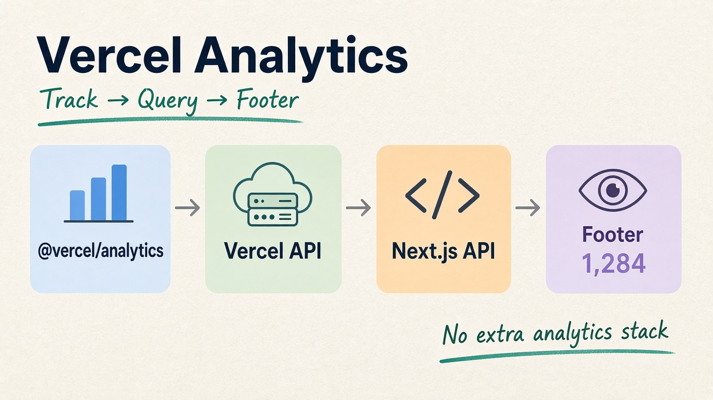

Vercel Web Analytics can be used to track website traffic without adding another analytics provider. On the Hobby plan, Web Analytics includes up to **50,000 events/month** and **30 days of viewable history**.



## 1. Enable Web Analytics

Enable **Web Analytics** in the Vercel project. For a basic website, the Hobby plan is enough to collect standard analytics data.

## 2. Install Vercel Analytics

For Next.js:

```bash
npm install @vercel/analytics
```

Then add Analytics to the public layout:

```tsx
import { Analytics } from '@vercel/analytics/next'

<Analytics />
```

## 3. Get Analytics Data

Vercel provides an API for querying Web Analytics:

```text
GET https://api.vercel.com/v1/query/web-analytics/visits/count
```

The request requires a Vercel access token and project ID.

Keep these values server-side:

```env
VERCEL_ACCESS_TOKEN=...
VERCEL_PROJECT_ID=...
VERCEL_TEAM_ID=...
```

Never expose the access token through `NEXT_PUBLIC_*`.

## 4. Display the Number in the Footer

Instead of calling Vercel directly from the browser, create a Next.js server API such as:

```text
/api/analytics/visits
```

The flow becomes:

```text
Vercel Analytics → Vercel API → Next.js API → Footer
```

The Footer can then display something like:

```text
👁 1,284 page views
```

The `/visits/count` metric should be described as **page views/visits**, not unique visitors.

## 5. Keep It Lightweight

The analytics API should be cached or revalidated so the application does not call Vercel on every page render. If the analytics API fails, the Footer should continue working normally and simply hide the analytics counter.

This keeps the architecture simple:

```text
@vercel/analytics
       ↓
Vercel Web Analytics
       ↓
Next.js Server API
       ↓
Frontend Footer
```