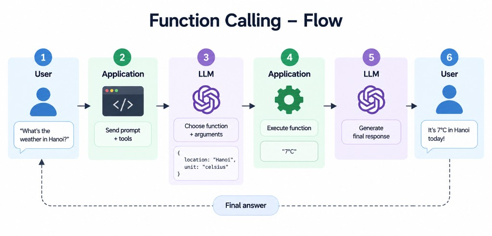

When building an AI chatbot, there is one important limitation: **an LLM can generate text, but it cannot directly execute your application code**.

For example, if the user asks:

> “What’s the weather like in Hanoi today?”

The LLM itself cannot call your weather API. This is where **Function Calling** comes in.

Function Calling allows us to give the LLM a list of available functions. The LLM analyzes the user's request, chooses the appropriate function, and returns the **function name + arguments**. Our application then executes that function and sends the result back to the LLM.


## How does the flow work?

The overall flow is:



The important thing to understand is:

> **The LLM does not execute the function. It only decides which function should be called and what arguments should be passed.**

Your application is responsible for actually executing the function.

## 1. Define your functions

For example:

```python
def get_current_weather(location: str, unit: str):
    """Get the current weather in a given location"""
    return "It's very cold, 7°C"


def get_stock_price(symbol: str):
    pass


def view_website(url: str):
    pass
```

We then describe these functions to the LLM through `tools`.

```python
tools = [
    {
        "type": "function",
        "function": {
            "name": "get_current_weather",
            "description": "Get the current weather in a given location",
            "parameters": {
                "type": "object",
                "properties": {
                    "location": {
                        "type": "string",
                        "description": "The city name"
                    },
                    "unit": {
                        "type": "string",
                        "enum": ["celsius", "fahrenheit"],
                        "description": "The temperature unit"
                    }
                },
                "required": ["location", "unit"]
            }
        }
    }
]
```

The LLM uses the **name, description, and parameters** to understand when and how a function should be used. Using `enum` is also useful when a parameter only accepts a fixed set of values.

## 2. Send the request to the LLM

```python
response = client.chat.completions.create(
    model="gpt-5.4-mini",
    messages=[
        {
            "role": "user",
            "content": "What's the weather in Hanoi today?"
        }
    ],
    tools=tools
)
```

The LLM analyzes the request and may return:

```python
tool_call = response.choices[0].message.tool_calls[0]

print(tool_call.function.name)
# get_current_weather

print(tool_call.function.arguments)
# {"location":"Hanoi","unit":"celsius"}
```

The model has essentially said:

```text
Call: get_current_weather

Arguments:
{
    "location": "Hanoi",
    "unit": "celsius"
}
```

This is the core idea of Function Calling: **the model requests a tool call instead of directly answering the user.**

## 3. Execute the function

Now your application takes those arguments and runs the actual function:

```python
import json

arguments = json.loads(
    tool_call.function.arguments
)

weather_result = get_current_weather(
    arguments["location"],
    arguments["unit"]
)

print(weather_result)
# It's very cold, 7°C
```

In a real application, this function could call a weather API, query a database, call another service, or execute some business logic.

So remember:

> **LLM decides what to call. Your application executes it.**

## 4. Send the result back to the LLM

We then send the tool result back:

```python
messages.append(response.choices[0].message)

messages.append({
    "role": "tool",
    "tool_call_id": tool_call.id,
    "content": weather_result
})
```

The LLM now has the complete context:

```text
User:
What's the weather in Hanoi today?

Assistant:
Call get_current_weather(
    location="Hanoi",
    unit="celsius"
)

Tool:
"It's very cold, 7°C"
```

We call the LLM again:

```python
final_response = client.chat.completions.create(
    model="gpt-5.4-mini",
    messages=messages
)

print(final_response.choices[0].message.content)
```

The LLM can now turn the raw tool result into a natural response:

> “It’s 7°C in Hanoi today, so you might want to wear something warm.”