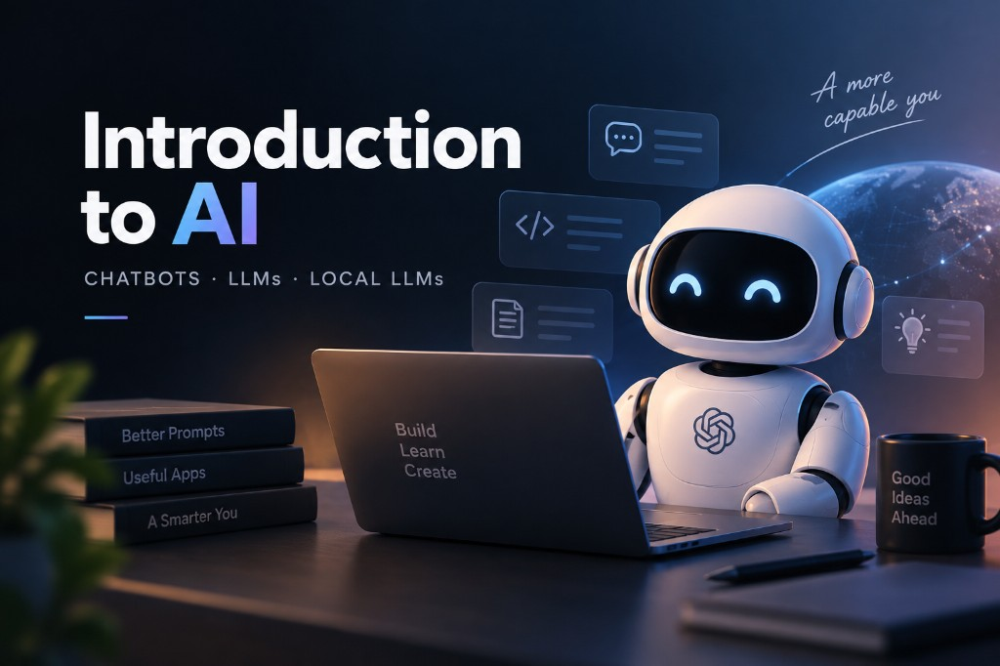

Artificial Intelligence (AI) has quickly become an important part of modern software development. Tools such as ChatGPT, Claude, and Gemini allow developers and other professionals to interact with AI using natural language and use it for many everyday tasks.



## What Is an AI Chatbot?

An AI chatbot is an application powered by AI models that can understand and generate natural language. Unlike traditional software, where users usually interact through predefined interfaces, AI chatbots allow users to describe what they need using natural language.

For developers, an AI chatbot can explain programming concepts, generate code, help debug errors, write tests, and create documentation. For office workers, it can help write emails, summarize documents, create reports, and brainstorm ideas. Content creators can use AI to generate ideas, create outlines, draft articles, and improve existing content.

The main value of AI chatbots is not simply replacing human work. Instead, they can help people work faster, automate repetitive tasks, and improve their ability to explore and create new ideas.

## What Is an LLM?

Most modern AI chatbots are built on top of **Large Language Models (LLMs)**. An LLM is a machine learning model trained on a very large amount of text data to learn patterns in language and generate text.

A simple way to understand an LLM is to think of it as a very advanced autocomplete system. Given a sequence of tokens, the model predicts what should come next. For example:

```text
The developer opened the ...
```

The model may predict words such as `editor`, `browser`, or `terminal`, depending on the context. By repeatedly predicting the next token, the model can generate complete sentences, paragraphs, code, and conversations.

Modern LLMs are much more than simple autocomplete systems. Through large-scale training and additional instruction or preference tuning, they can perform tasks such as summarization, translation, coding, reasoning, and content generation.

## How Are LLMs Trained?

Machine learning includes several different training approaches. **Supervised learning** uses labeled data, where the expected output is known. **Unsupervised learning** works with unlabeled data and attempts to discover patterns in the data. Modern LLM training also relies heavily on **self-supervised learning**, where the training signal can be created directly from the data itself, such as predicting the next token.

After pre-training, models can go through additional training such as instruction tuning and preference optimization to make them more useful and aligned with human instructions.

## Limitations of LLMs

LLMs are powerful, but they are not perfect. One common problem is **hallucination**, where a model generates information that sounds convincing but is incorrect. Developers should therefore verify important information instead of blindly trusting the model.

Another limitation is that a model may not know about recent events or private information unless that information is provided through additional sources such as web search, APIs, databases, or RAG systems.

LLMs can also make mistakes in mathematical or highly precise tasks. For these situations, applications can combine LLMs with tools such as calculators, code execution, or external APIs to improve reliability.

## AI Alignment and Jailbreaking

AI systems are designed with safety mechanisms to prevent certain harmful or inappropriate outputs. **AI alignment** broadly refers to the effort to make AI systems behave according to intended goals, instructions, and safety requirements.

Sometimes users attempt to bypass these restrictions using adversarial prompts. This is commonly referred to as **jailbreaking**. From a developer perspective, understanding these concepts is useful when building secure AI applications, especially when dealing with prompt injection and untrusted user input.
