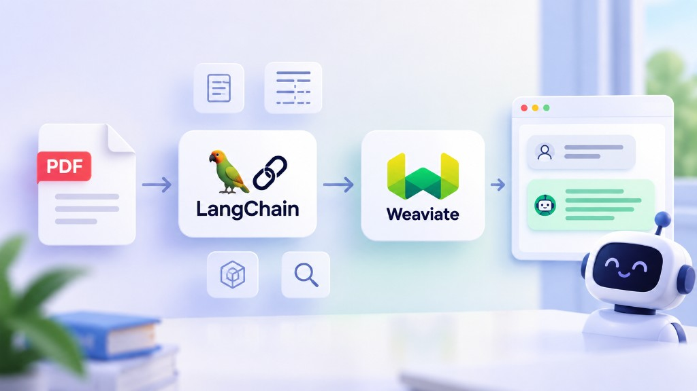

[**LangChain**](https://www.langchain.com/) is an open-source framework for building applications powered by **LLMs**. It provides reusable components for common AI tasks, so instead of implementing everything from scratch, we can simply connect the components we need.

For our **Chat with PDF** application, we'll mainly use LangChain for four things: **loading documents → chunking → storing embeddings → retrieving relevant documents**.



## 1. Document Loader

First, we need to read the content from our PDF. LangChain provides many **Document Loaders** for different data sources. For PDFs, we can use `PyMuPDFLoader`:

```python
from langchain_community.document_loaders import PyMuPDFLoader

loader = PyMuPDFLoader("docs/monopoly.pdf")
documents = loader.load()
```

The result is a list of **`Document`** objects. Each document contains `page_content` for the actual content and `metadata` for information such as the file path and page number.

## 2. Chunking

PDFs can be quite large, so we need to split them into smaller **chunks** before generating embeddings. LangChain provides several text splitters. In this project, we'll use `RecursiveCharacterTextSplitter`:

```python
from langchain_text_splitters import RecursiveCharacterTextSplitter

text_splitter = RecursiveCharacterTextSplitter(
    chunk_size=700,
    chunk_overlap=100,
)

chunks = text_splitter.split_documents(documents)
```

The nice thing about `split_documents()` is that it splits the content while keeping the original document metadata.

## 3. Embeddings + Weaviate

Once we have the chunks, we need to generate **embeddings** and store them in a Vector Database so we can search by semantic meaning.

We already worked with [**Weaviate**](/weaviate-vector-databases/) in the previous section. This time, we can use Weaviate through LangChain:

```python
from langchain_weaviate import WeaviateVectorStore

vectorstore = WeaviateVectorStore.from_documents(
    documents=chunks,
    embedding=embeddings,
    client=client,
    index_name="PDFDocuments",
)
```

Here, **LangChain acts as the integration layer**, while **Weaviate remains our Vector Database**. LangChain gives us a common interface, so we can work with the vector store without dealing with all of its low-level details.

## 4. Retriever

Finally, we need to find the chunks that are most relevant to the user's question. LangChain provides a **Retriever** for this:

```python
retriever = vectorstore.as_retriever(
    search_kwargs={"k": 4}
)

documents = retriever.invoke(
    "How much money does each player start with?"
)
```

The Retriever searches Weaviate and returns the relevant documents. We can then pass these documents together with the user's question to an LLM to generate the final answer.

So the data pipeline for our **Chat with PDF** application looks like this:

```text
PDF
 ↓
Document Loader
 ↓
Chunking
 ↓
Embeddings + Weaviate
 ↓
Retriever
 ↓
LLM
 ↓
Answer
```

That's basically how LangChain helps us connect the different pieces together. Next, we'll implement each step and build the actual **Chat with PDF** application.
