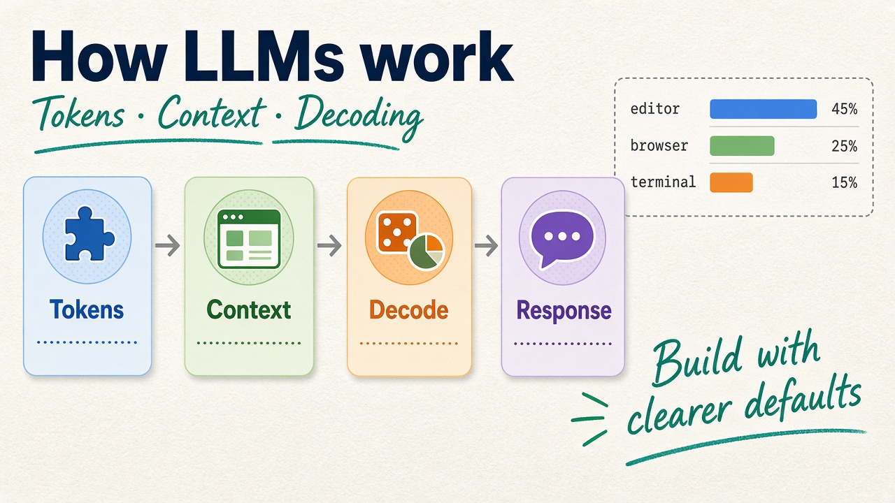

If you are a developer building applications with LLMs, you do not need to understand every detail of how a model is trained. However, understanding how an LLM generates text, how tokens work, and how different types of models are used will help you build better AI applications.



## How Does an LLM Generate Text?

At a basic level, an LLM predicts the next **token** based on the tokens that came before it. The model assigns probabilities to possible next tokens and selects one according to a decoding strategy.

For example:

```text
The developer opened the ...
```

The model might assign probabilities such as:

```text
editor   → 45%
browser  → 25%
terminal → 15%
laptop   → 10%
...
```

The selected token is added to the sequence, and the model repeats the process until it finishes generating the response.

### Decoding Strategies

**Greedy decoding** always selects the token with the highest probability. It is simple and deterministic, but it can produce repetitive or less interesting results.

**Beam search** keeps several of the most promising sequences instead of following only one. It can be useful for some structured generation tasks, although it is less common for open-ended chatbot generation.

**Sampling** introduces randomness into the selection process. This allows the model to generate more diverse responses, but too much randomness can also produce low-quality or unexpected results.

Several parameters can control this behavior. **Temperature** controls how strongly the model favors high-probability tokens. **Top-k** limits sampling to the k most likely tokens, while **top-p** samples from the smallest set of tokens whose combined probability reaches a specified threshold.

In practice, these parameters are useful when you want to balance **predictability, diversity, and creativity**.

## Tokens and Tokenizers

Tokens are one of the most important concepts when working with LLM APIs. A token is a small unit of text that the model processes. Depending on the tokenizer, a token can represent a complete word, part of a word, punctuation, or other characters.

A **tokenizer** converts text into tokens that can be represented as numbers and processed by the model.

There are three common approaches:

* **Character-based:** splits text into individual characters.
* **Word-based:** splits text into complete words.
* **Subword-based:** splits text into words or smaller pieces.

Modern LLMs commonly use subword-based tokenization because it provides a good balance between vocabulary size, efficiency, and the ability to handle new or uncommon words.

For developers, tokens matter because they affect **context limits, API costs, latency, and model performance**.

## Context Size

The **context window** is the maximum amount of information a model can consider in a single interaction. It can include system instructions, conversation history, user messages, documents, and tool results.

For example:

```text
System instructions
        +
Conversation history
        +
User request
        +
Retrieved documents
        +
Tool results
        ↓
   Context Window
        ↓
       LLM
```

A larger context window allows an application to work with more information, but it can also increase processing costs and latency.

## Foundation Models vs. Instruction Models

Another important distinction is between **foundation models** and **instruction/chat models**.

A foundation model is trained primarily to learn general patterns from large amounts of data. A simplified example is a base language model that learns to predict the next token.

An instruction or chat model is further trained to follow human instructions and produce responses in a conversational format.

For example:

```text
Foundation Model
        ↓
Instruction / Preference Tuning
        ↓
Instruction Model
        ↓
Chat Application
```

This distinction is important because developers usually want an instruction-tuned model when building a chatbot rather than a raw foundation model.

## Prompt Structure

When working with chat-based LLM APIs, messages are typically separated by their roles. A common structure includes **system/developer instructions**, **user messages**, and **assistant responses**.

For example:

```text
System:
You are a helpful programming assistant.

User:
Explain React Query.

Assistant:
React Query is a library for...
```

The exact roles and API format depend on the provider and API version, but the idea is the same: developers provide instructions and context that guide the model's behavior.

Clear instructions are especially important when working with smaller models because they may be less capable of interpreting ambiguous prompts.

## Local LLM vs. Cloud API

Developers generally have two options when integrating an LLM: use a **cloud API** or run a **local LLM**.

A simple decision might look like this:

```text
Personal project / Prototype
        ↓
     Cloud API

Privacy / Offline / Infrastructure Control
        ↓
     Local LLM
```

There is no universal choice. The right approach depends on factors such as **cost, privacy, model capability, latency, infrastructure, and expected traffic**.
