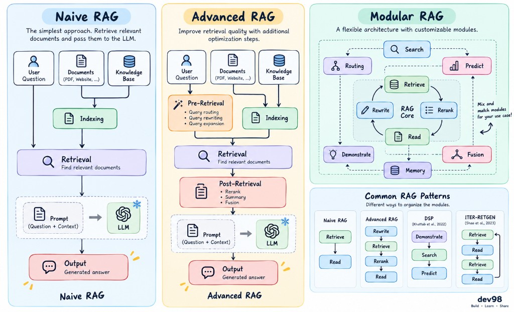

In the previous section, we explored what RAG is and why it is important.

In this section, we will take a closer look at different types of RAG systems and compare RAG with other techniques.

## RAG Systems: From Basic to Advanced

There is no single official classification for RAG systems. However, they are commonly categorized based on their complexity and approach:

### 1. Naive RAG

**Naive RAG** is the simplest approach.

When a user asks a question, the system searches for relevant information and passes the retrieved content to the LLM, which then generates an answer.

Because there is little or no optimization involved, this approach can lead to several problems:

* Retrieving irrelevant information
* Retrieving duplicate information
* Spending more time processing unnecessary data

### 2. Advanced RAG

**Advanced RAG** improves retrieval quality by introducing additional optimization steps, such as:

* Storing and indexing data more intelligently
* Rewriting and optimizing the original query to improve retrieval accuracy
* Ranking search results

### 3. Modular RAG

**Modular RAG** is a more flexible approach that allows each part of the system to be customized independently.

For example, you can:

* Customize individual modules such as retrieval, processing, and generation
* Add new capabilities, such as conversational memory
* Adjust the system to fit the requirements of a specific application

---

## RAG vs. Function Calling

You might be wondering:

> Isn't retrieving external information and giving it to an LLM basically the same thing as Function Calling?

**Yes! Both RAG and Function Calling are different approaches to extending the capabilities of an LLM.**

However, they are designed for different types of problems.

### When should you use each one?

#### Use Function Calling when:

* You need to perform well-defined, structured tasks, such as booking a ticket or creating an appointment
* You need to interact with an external API or system
* You need strict control over the output format

#### Use RAG when:

* You need to answer questions based on external or up-to-date information
* You are working with data that changes frequently
* You need to provide references or sources
* You are handling open-ended questions without a fixed structure

In real-world applications, you will often combine **RAG and Function Calling** to take advantage of both approaches.

For example, we can combine them to build a product-support chatbot.

### 1. The user asks a question

We can use **Function Calling** to determine which function should be called, such as:

* `search_product`
* `get_shopping_cart`
* `get_order_history`

These functions can retrieve product information, shopping cart contents, or order history from the application.

### 2. The user asks about a product

After searching for the relevant products, we can retrieve the most relevant product information and pass it to the LLM to generate a response.

Here, **Function Calling** is useful for interacting with the product system, while **RAG** can be used to retrieve additional product-related information.

### 3. The user asks about shipping, orders, or payment policies

We can use **RAG** to retrieve the most relevant documentation, such as:

* Support phone numbers
* Support email addresses
* Links to relevant pages
* Shipping policies
* Payment policies
* Other support documentation

The retrieved information is then passed to the LLM to generate the final response.
