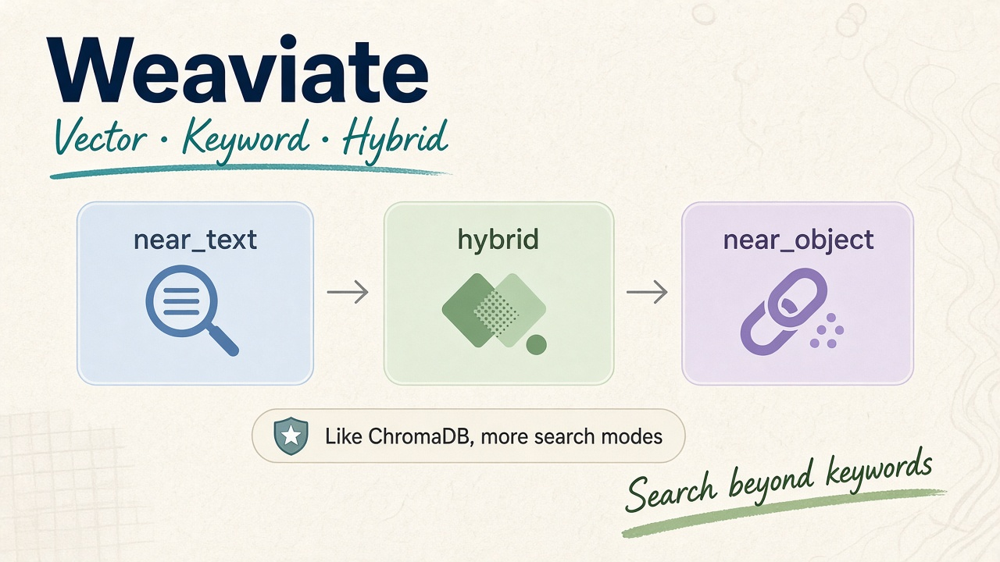

If you've already worked with [**ChromaDB**](/chromadb/), getting started with **Weaviate** is quite straightforward.

Both are vector databases that can store objects, embeddings, and metadata, then retrieve data using semantic search.



## What is Weaviate?

[**Weaviate**](https://weaviate.io/developers/weaviate) is an open-source vector database designed for AI applications.

Just like ChromaDB, you can use it to:

* Store objects and embeddings
* Perform semantic search
* Filter data
* Build RAG applications
* Build recommendation systems

One of the nice things about Weaviate is that it also provides **keyword search and hybrid search** out of the box.

---

## Weaviate vs ChromaDB

Since we already know ChromaDB, here's the simple comparison:

|                     | ChromaDB | Weaviate |
| ------------------- | -------- | -------- |
| Vector search       | ✅        | ✅        |
| Metadata            | ✅        | ✅        |
| Semantic search     | ✅        | ✅        |
| Keyword search      | Basic    | ✅        |
| Hybrid search       | —        | ✅        |
| Filtering           | ✅        | ✅        |
| RAG                 | ✅        | ✅        |
| Cloud / Self-hosted | ✅        | ✅        |

In short:

```text
ChromaDB
→ Simple and easy to get started

Weaviate
→ More built-in search capabilities
```

For a simple local project, ChromaDB can be enough. If you need more advanced search capabilities, Weaviate is worth considering.

---

## Using Weaviate

Let's use a movie dataset as an example.

### 1. Install

```bash
pip install weaviate-client pandas
```

### 2. Create a collection

Weaviate organizes data into **collections**, similar to collections in ChromaDB.

```python
import weaviate
from weaviate.classes.config import Configure, Property, DataType

client = weaviate.connect_to_local()

movies = client.collections.create(
    name="Movie",
    vector_config=Configure.Vectors.text2vec_sentence_transformers(),
    properties=[
        Property(name="title", data_type=DataType.TEXT),
        Property(name="description", data_type=DataType.TEXT),
        Property(name="genres", data_type=DataType.TEXT_ARRAY),
    ],
)
```

### 3. Insert data

```python
movies.data.insert(
    properties={
        "title": "Extraction",
        "description": "A black-market mercenary...",
        "genres": ["Action", "Thriller"],
    }
)
```

For multiple objects, we can use batch insertion:

```python
with movies.batch.dynamic() as batch:
    for movie in movie_data:
        batch.add_object(properties=movie)
```

### 4. Semantic search

We can search by meaning using `near_text()`:

```python
response = movies.query.near_text(
    query="funny movies for children",
    limit=5,
)

for result in response.objects:
    print(result.properties)
```

Instead of looking for the exact words, Weaviate searches for movies that are semantically related to the query.

### 5. Hybrid search

We can also combine keyword and semantic search:

```python
response = movies.query.hybrid(
    query="thriller",
    alpha=0.5,
    limit=5,
)
```

Here:

```text
alpha = 0
→ Keyword search

alpha = 0.5
→ Keyword + Vector search

alpha = 1
→ Vector search
```

### 6. Find similar objects

Weaviate can also find objects similar to an existing object:

```python
response = movies.query.near_object(
    near_object=movie_id,
    limit=5,
)
```

This is useful for recommendation features such as:

```text
Extraction
    ↓
Similar movies
    ↓
Unhinged
The Contractor
...
```