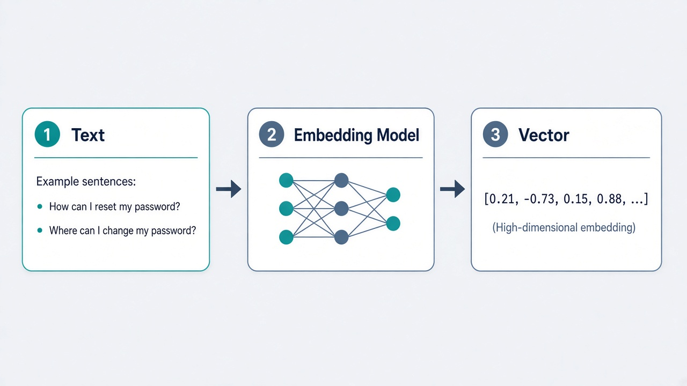

If you are learning about **LLMs, RAG, or Vector Databases**, you will often hear the word **embedding**.

The simplest definition is:

> **An embedding turns data into numbers so a computer can compare meaning.**

## 1. What Is an Embedding?



Computers cannot understand meaning the same way humans do.

For example:

```text
"How can I reset my password?"
"Where can I change my password?"
```

These sentences use different words, but have a similar meaning.

An embedding model converts text into a **vector of numbers**:

```text
Text
 ↓
Embedding Model
 ↓
[0.21, -0.73, 0.15, 0.88, ...]
```

The numbers are not random. Together, they represent patterns and relationships in the text.

So you can think of an embedding as a **numeric representation of meaning**.

---

## 2. Similar Meaning → Similar Vectors

This is the most important idea.

For example:

```text
"dog"
"puppy"
"golden retriever"
```

These concepts are related, so their vectors should generally be close together.

But:

```text
"dog"
"stock market"
```

would be much less similar.

This allows computers to compare **semantic similarity**, rather than only matching exact keywords.

---

## 3. Embeddings Enable Semantic Search

Imagine you have documents containing:

```text
"Customers can request a refund within 7 days."
```

A user asks:

```text
"How long do I have to get my money back?"
```

There may be no exact keyword match, but the meanings are similar.

The system can:

```text
User Question
     ↓
Embedding Model
     ↓
Query Vector
     ↓
Search Vector Database
     ↓
Find Similar Vectors
     ↓
Relevant Documents
```

This is called **semantic search**.

Common similarity methods include **cosine similarity, dot product, and Euclidean distance**.

---

## 4. Embeddings + Vector Database + LLM = RAG

An embedding model is **not a database** and it does **not answer questions**.

Each component has a different job:

```text
Embedding Model
→ Turn text into vectors

Vector Database
→ Store and search vectors

LLM
→ Generate the final answer
```

For example, with 20 PDF files:

```text
PDFs
 ↓
Extract Text
 ↓
Split into Chunks
 ↓
Create Embeddings
 ↓
Store in Vector Database
 ↓
User asks a question
 ↓
Search for relevant chunks
 ↓
Give chunks to LLM
 ↓
Answer
```

This is the basic architecture of **RAG (Retrieval-Augmented Generation)**.

---

## 5. What Happens When Documents Change?

In a real application, documents can be updated.

For example:

```text
refund-policy.pdf
     ↓
SHA-256 Hash
     ↓
abc123
```

Later, the PDF changes:

```text
refund-policy.pdf
     ↓
SHA-256 Hash
     ↓
xyz789
```

The different hash tells the system that the document has changed.

You can then:

```text
Delete old chunks
      ↓
Extract new text
      ↓
Create new chunks
      ↓
Create new embeddings
      ↓
Store updated data
```

For a small collection such as **20 PDFs**, this simple approach is usually enough.

### The Simple Mental Model

Just remember:

> **Embedding = Turn meaning into numbers.**

> **Vector Database = Store and find similar vectors.**

> **LLM = Use the retrieved information to generate an answer.**

Together:

```text
Documents
   ↓
Chunking
   ↓
Embeddings
   ↓
Vector Database
   ↓
Semantic Search
   ↓
Relevant Context
   ↓
LLM
   ↓
Answer
```