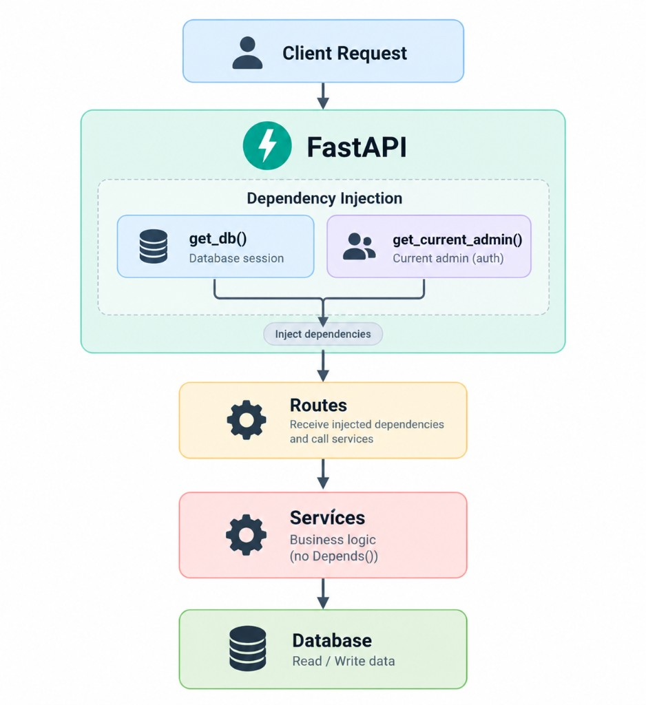

**Dependency Injection** (DI) lets a function declare what it needs while another component provides it, reducing coupling and making the code easier to test and maintain.



# The basic idea

Without DI, a route might create its own database session:

```python
async def get_plants():
    db = AsyncSessionLocal()
    ...
    await db.close()
```

The route now has to know how to create and clean up the database session.

With DI:

```python
async def get_plants(
    db: AsyncSession = Depends(get_db),
):
    ...
```

The route only says: **"I need a database session."** FastAPI takes care of getting it.

This separates **what the route needs** from **how that dependency is created**.

# Dependencies can depend on dependencies

DI becomes more useful when dependencies are composed.

We have `get_current_admin`:

```python
async def get_current_admin(
    request: Request,
    db: AsyncSession = Depends(get_db),
) -> Admin:
    ...
```

`get_current_admin` needs a database session, so it depends on `get_db`.

# Why DI is useful

The main benefit is **loose coupling**. Routes don't need to know how dependencies are created, authentication logic doesn't need to be repeated, and services don't need to depend on FastAPI.

DI also makes testing easier because dependencies can be replaced. For example, the project replaces the database session factory in tests so routes can use a test database without changing the route implementation.

```python
app.dependency_overrides[get_db] = get_test_db
```