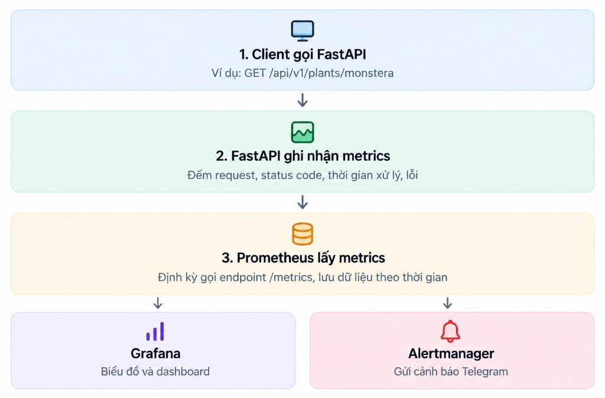

## The Big Picture

<div style={{ maxWidth: 700, margin: '0 auto' }}>



</div>

To monitor our FastAPI application running on a single VPS, we use Prometheus, Grafana, Alertmanager, and several exporters.

The monitoring workflow consists of five main steps:

1. **Client calls FastAPI**

   For example, the frontend sends `GET /api/v1/plants/monstera` to retrieve plant details.

2. **FastAPI records metrics**

   Middleware tracks HTTP requests, status codes, response times, and application exceptions.

3. **Prometheus collects and stores metrics**

   Prometheus periodically scrapes the `/metrics` endpoint exposed by FastAPI and other configured exporters. It stores the collected data as time series and evaluates alert rules.

4. **Grafana visualizes metrics**

   Grafana queries Prometheus using PromQL and displays metrics in dashboards, including request rates, error rates, latency, CPU, memory, and database statistics.

5. **Alertmanager sends notifications**

   When an alert rule is triggered, Prometheus sends the alert to Alertmanager. Alertmanager groups and routes alerts, then sends Telegram notifications according to its configuration.


## Basic Setup

In this section, we'll set up a basic monitoring stack for a FastAPI application running on a single VPS using Docker Compose.

### 1. Project Structure

We can keep monitoring-related configuration separate from the application code:

```text
project/
├── app/
│   └── main.py
├── monitoring/
│   ├── prometheus/
│   │   └── prometheus.yml
│   └── alertmanager/
│       └── alertmanager.yml
├── docker-compose.yml
└── docker-compose.monitoring.yml
```

This separation makes the monitoring stack easier to configure and maintain.

### 2. Instrument FastAPI

Install the Prometheus Python client:

```bash
pip install prometheus-client
```

Expose a `/metrics` endpoint so Prometheus can collect application metrics:

```python
from fastapi import FastAPI, Response
from prometheus_client import (
    CONTENT_TYPE_LATEST,
    generate_latest,
)

app = FastAPI()


@app.get("/metrics", include_in_schema=False)
def metrics():
    return Response(
        content=generate_latest(),
        media_type=CONTENT_TYPE_LATEST,
    )
```

In production, protect the `/metrics` endpoint and configure Prometheus to authenticate when scraping it.

### 3. Configure Prometheus

Create `monitoring/prometheus/prometheus.yml`:

```yaml
global:
  scrape_interval: 15s

scrape_configs:
  - job_name: "fastapi"
    metrics_path: /metrics
    static_configs:
      - targets: ["api:8000"]

  - job_name: "prometheus"
    static_configs:
      - targets: ["prometheus:9090"]
```

The `api:8000` target refers to the FastAPI service name and internal port on the shared Docker network.

Prometheus scrapes the configured targets every 15 seconds and stores the collected metrics as time series.

If `/metrics` requires a token, configure `bearer_token_file` and mount the corresponding secret into the Prometheus container.

### 4. Run the Monitoring Stack

Add Prometheus and Grafana to your Docker Compose configuration. A minimal example is:

```yaml
services:
  prometheus:
    image: prom/prometheus:v3.1.0
    ports:
      - "127.0.0.1:9090:9090"
    volumes:
      - ./monitoring/prometheus:/etc/prometheus:ro
      - prometheus_data:/prometheus
    command:
      - --config.file=/etc/prometheus/prometheus.yml
      - --storage.tsdb.path=/prometheus
    networks:
      - monitoring

  grafana:
    image: grafana/grafana:11.4.0
    ports:
      - "127.0.0.1:3001:3000"
    volumes:
      - grafana_data:/var/lib/grafana
    networks:
      - monitoring

networks:
  monitoring:

volumes:
  prometheus_data:
  grafana_data:
```

Make sure the FastAPI service also joins the `monitoring` network. If you're using an existing application Compose file, merge the configuration rather than creating duplicate services or networks.

Start the stack:

```bash
docker compose \
  -f docker-compose.yml \
  -f docker-compose.monitoring.yml \
  up -d
```

Check the running containers:

```bash
docker compose ps
```

### 5. Verify Prometheus

Open the Prometheus Targets page:

```text
http://localhost:9090/targets
```

If the target is `UP`, Prometheus can scrape its metrics endpoint successfully.

You can also open the Prometheus query page and run:

```promql
up
```

A value of `1` indicates that the corresponding target was successfully scraped. A value of `0` indicates a scrape failure.

### 6. Connect Grafana to Prometheus

Open Grafana:

```text
http://localhost:3001
```

Add a Prometheus data source with the URL:

```text
http://prometheus:9090
```

Use the internal service name when Grafana and Prometheus share the same Docker network. The URL `http://localhost:9090` would refer to the Grafana container itself, not the Prometheus container.

After saving the data source, create a dashboard with panels for request rate, error rate, latency, and infrastructure resources. The corresponding metrics must be exported and scraped before those panels can display data.

### 7. Configure Telegram Alerts

Alerting requires two configurations: Prometheus alert rules and an Alertmanager receiver.

For example, a basic Prometheus alert rule might be:

```yaml
groups:
  - name: api-alerts
    rules:
      - alert: FastAPIDown
        expr: up{job="fastapi"} == 0
        for: 1m
        labels:
          severity: critical
        annotations:
          summary: "FastAPI is unavailable"
```

Configure Prometheus to load the rule file and send alerts to Alertmanager. Then configure Alertmanager with a Telegram receiver that uses a bot token and chat ID.

Keep the bot token in a secret file or another secure secret-management mechanism. Do not commit it to Git.

When the alert condition is met, Prometheus sends the alert to Alertmanager, which routes the notification to Telegram according to its configuration.

### 8. Access Monitoring Securely

For a single VPS, avoid exposing Prometheus and Alertmanager directly to the public Internet without appropriate authentication and access controls.

One simple approach is to bind their ports to `127.0.0.1` and access them from your local machine through an SSH tunnel:

```bash
ssh -N \
  -L 3001:127.0.0.1:3001 \
  -L 9090:127.0.0.1:9090 \
  -L 9093:127.0.0.1:9093 \
  user@your-vps
```

Replace `user@your-vps` with your actual SSH username and VPS address.

You can then open Grafana, Prometheus, and Alertmanager using their respective localhost URLs.

This approach keeps the monitoring interfaces private while allowing you to inspect application health and troubleshoot production issues.