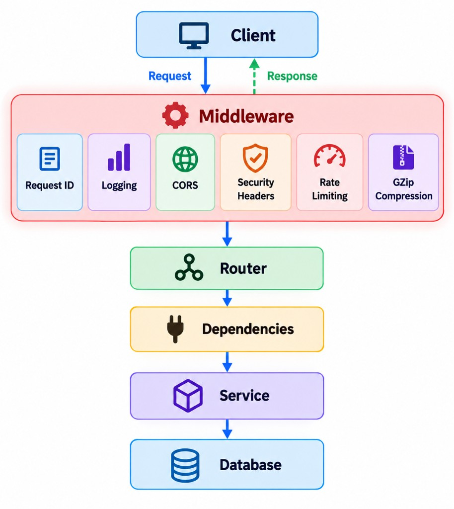

Middleware is a layer that sits between the client and your FastAPI application. It can process a request before it reaches the endpoint and process the response before it is sent back to the client.



# How Middleware Works

A simple custom middleware looks like this:

```python
import time

from fastapi import FastAPI, Request

app = FastAPI()


@app.middleware("http")
async def timing_middleware(request: Request, call_next):
    start = time.perf_counter()

    response = await call_next(request)

    response.headers["X-Process-Time"] = (
        f"{time.perf_counter() - start:.4f}"
    )

    return response
```

- Code **before `call_next()`** runs when the request comes in.
- `call_next()` passes the request to the next layer.
- Code **after `call_next()`** runs when the response comes back.

# Common Uses of Middleware

## Logging

Log information such as:, HTTP method, URL, Status code, Processing time, Request ID

For example:

```text
GET /api/plants → 200 → 42ms
POST /api/orders → 201 → 85ms
```

## Request ID

Assign a unique ID to each request so it can be traced through logs and services.

```text
Request
   ↓
request_id = abc-123
   ↓
Service
   ↓
Database
```

## Request Timing

Measure how long a request takes:

```http
X-Process-Time: 0.0421
```

This is useful for monitoring and performance debugging.

## Security Headers

Add headers such as:

```text
X-Content-Type-Options
X-Frame-Options
Strict-Transport-Security
```

## CORS

Control which browser origins are allowed to call your API.

## GZip

Compress larger responses to reduce network payload size.

## Rate Limiting

Limit how frequently clients can call your API and help protect public endpoints from abuse.

# request.state

Middleware can attach request-scoped data to `request.state`.

For example, a request ID middleware:

```python
import uuid


@app.middleware("http")
async def request_id_middleware(request: Request, call_next):
    request_id = request.headers.get("X-Request-ID", str(uuid.uuid4()))
    request.state.request_id = request_id

    response = await call_next(request)

    response.headers["X-Request-ID"] = request_id
    return response
```

It reuses the client's `X-Request-ID` if one was sent, otherwise it generates a new one, and returns it in the response so the client can report it.

A dependency or endpoint can then access it:

```python
request.state.request_id
```

`request.state` is useful for data that belongs to the current request. It should not be treated as global application state.

# Two Ways to Write Custom Middleware

## HTTP Middleware

The simplest approach is:

```python
@app.middleware("http")
async def logging_middleware(request: Request, call_next):
    response = await call_next(request)
    return response
```

This is usually enough for normal request/response processing.

## ASGI Middleware

ASGI middleware works at a lower level. It is a class that wraps the application and implements `__call__`:

```python
class SimpleASGIMiddleware:
    def __init__(self, app):
        self.app = app

    async def __call__(self, scope, receive, send):
        if scope["type"] != "http":
            await self.app(scope, receive, send)
            return

        # inspect or modify the request here

        await self.app(scope, receive, send)


app.add_middleware(SimpleASGIMiddleware)
```

It works directly with:

- `scope` — connection/request information
- `receive` — receives ASGI messages
- `send` — sends ASGI messages