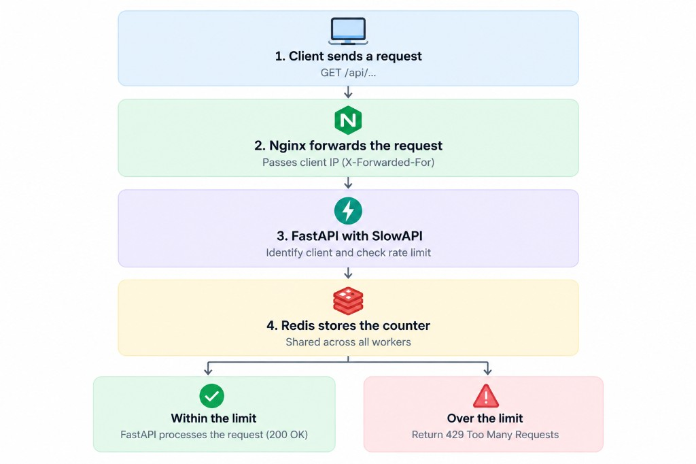

## 1. What Is Rate Limiting?

Rate limiting controls **how many requests a client can make within a specific period of time**.

For example, an IP address may be allowed to attempt login only five times per minute.

Without rate limiting, an API can be abused to:

- Guess passwords through brute-force attacks.
- Spam order forms and reviews.
- Increase AI API costs through excessive requests.
- Consume server resources and slow down other users.

When a client exceeds the configured limit, the API returns **HTTP 429 Too Many Requests**. A `Retry-After` header can tell the client how many seconds to wait before retrying.

## 2. What Is SlowAPI?

[SlowAPI](https://github.com/laurentS/slowapi) is a rate-limiting library for FastAPI and Starlette, adapted from Flask-Limiter.

It uses the [`limits`](https://limits.readthedocs.io/) library to manage counters and enforce request limits.

Instead of implementing the entire counting mechanism yourself, you can apply limits directly to FastAPI endpoints using decorators.

## 3. How Does Rate Limiting Work?

<div style={{ maxWidth: 700, margin: '0 auto' }}>



</div>

For every request, the rate limiter performs three steps:

1. **Identify the client:** Usually by IP address or user ID.
2. **Count the request:** Update the corresponding counter.
3. **Check the limit:** Allow the request to continue or return HTTP 429.

For example, with a limit of `5/minute`, the sixth request within the same limiting window will be rejected.

Counters are stored in a storage backend:

- `memory://` stores counters inside the Python process.
- `redis://` stores counters in Redis, allowing multiple workers or servers to share them.

## 4. Install SlowAPI

Install the required libraries:

```bash
pip install slowapi redis
```

SlowAPI uses the `limits` library internally to manage rate limits.

### 1. Initialize the Rate Limiter

Create a shared limiter for your FastAPI application:

```python
from fastapi import FastAPI
from slowapi import Limiter, _rate_limit_exceeded_handler
from slowapi.errors import RateLimitExceeded
from slowapi.util import get_remote_address

app = FastAPI()

limiter = Limiter(
    key_func=get_remote_address,
    storage_uri="memory://",
    headers_enabled=True,
)

app.state.limiter = limiter

app.add_exception_handler(
    RateLimitExceeded,
    _rate_limit_exceeded_handler,
)
```

Here's what each option does:

- `key_func`: Identifies the client. This example uses the client's IP address.
- `storage_uri`: Specifies where request counters are stored.
- `headers_enabled=True`: Enables rate-limit response headers.
- `app.state.limiter`: Registers the limiter with the FastAPI application.
- `add_exception_handler`: Handles requests that exceed their limits.

In this example, `memory://` is a simple choice for local development and experimentation.

### 2. Limit an Individual Endpoint

Use the `@limiter.limit()` decorator to restrict requests to a specific endpoint:

```python
from fastapi import Request, Response

@app.post("/login")
@limiter.limit("5/minute")
async def login(
    request: Request,
    response: Response,
):
    return {"message": "Login endpoint"}
```

This endpoint allows five requests per minute per client IP.

SlowAPI requires the `request: Request` parameter to identify the client. If your endpoint returns a dictionary or Pydantic model rather than an existing `Response` object, add `response: Response` so the library can attach rate-limit headers.

Common limit formats include:

| Configuration | Meaning |
|---|---|
| `5/minute` | 5 requests per minute |
| `100/hour` | 100 requests per hour |
| `10/minute;200/day` | Both limits apply simultaneously |

### 3. Set a Global Rate Limit

Besides individual endpoint limits, you can configure a default limit for the application.

For example, allow each IP address up to 200 requests per minute:

```python
from slowapi.middleware import SlowAPIASGIMiddleware

limiter = Limiter(
    key_func=get_remote_address,
    application_limits=["200/minute"],
)

app.state.limiter = limiter
app.add_middleware(SlowAPIASGIMiddleware)
```

You can exclude endpoints such as health checks:

```python
@app.get("/health")
@limiter.exempt
async def health():
    return {"status": "ok"}
```

In production, verify the middleware and exception-handler configuration against the SlowAPI version you use.

### 4. Why Does Production Often Need Redis?

With `memory://`, each worker maintains its own counters.

Suppose your application runs four workers, each enforcing a limit of five requests per minute. A client may exceed the intended limit because each worker only knows about its own requests.

Redis solves this by storing counters in a shared backend:

```python
limiter = Limiter(
    key_func=get_remote_address,
    storage_uri="redis://redis:6379/0",
    headers_enabled=True,
)
```

With Docker Compose, Redis can run as a separate service:

```yaml
services:
  redis:
    image: redis:7-alpine
    command:
      - redis-server
      - --save
      - ""
      - --appendonly
      - "no"
```

This configuration disables RDB snapshots and AOF persistence because rate-limit counters can be recreated.

Redis is particularly useful when running multiple workers or servers. If your application runs a single worker on a small VPS, `memory://` may be simpler, provided you accept that counters reset when the process restarts.