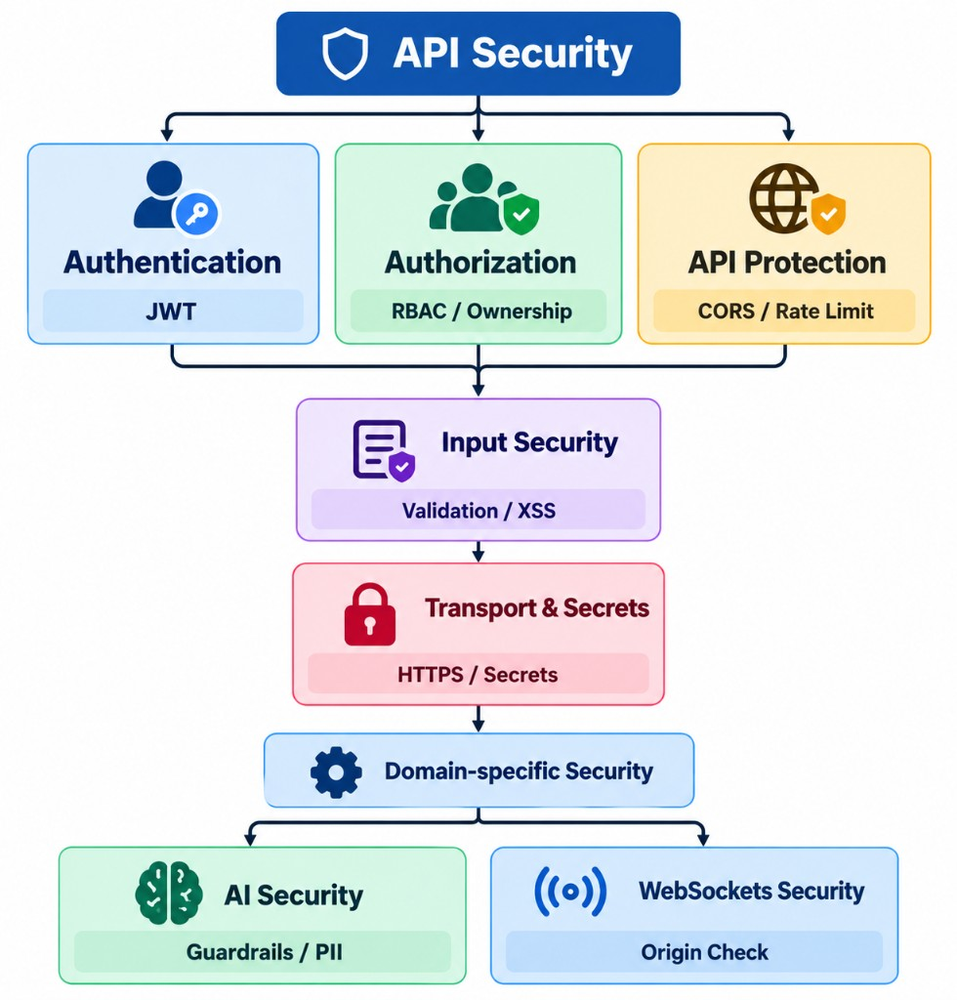

Security in a production API is not a single feature.

JWT alone is not enough. CORS alone is not enough. Rate limiting alone is not enough.

A secure API uses **multiple layers**, where each layer protects against a different type of threat.

The goal is **defense in depth**: if one layer fails, other layers still provide protection.



# Auth

## Authentication: Who Are You?

Authentication answers:

> **Who is making this request?**

A common approach is JWT authentication.

After login, the server issues a token:

```text
POST /login
      ↓
   Validate credentials
      ↓
   Generate JWT
      ↓
   Return token
```

## Authorization: What Are You Allowed to Do?

Authentication tells us **who the user is**.

Authorization tells us:

> **What is this user allowed to do?**

For example:

```text
Admin
 ├── Create product
 ├── Update product
 └── Delete product

Customer
 ├── View product
 └── Create order
```

## CORS

CORS controls which browser origins are allowed to access the API.

For example:

```python
app.add_middleware(
    CORSMiddleware,
    allow_origins=[
        "https://myapp.com"
    ],
    allow_credentials=True,
    allow_methods=["*"],
    allow_headers=["*"],
)
```

Avoid blindly using:

```python
allow_origins=["*"]
```

# Rate limiting

Rate limiting controls how frequently a client can call an endpoint.

For example:

```text
100 requests / minute / IP
```

When the limit is exceeded:

```text
429 Too Many Requests
```

A library such as SlowAPI can provide route-level limits:

```python
@limiter.limit("100/minute")
async def products(request: Request):
    ...
```

Rate limiting helps reduce:

- Spam
- Brute-force attempts
- API abuse
- Excessive resource consumption

For sensitive endpoints such as login, password reset, or expensive AI endpoints, stricter limits are often appropriate.

# Security headers

Middleware is useful for security concerns that apply across many or all requests.

Typical examples include:

```text
CORS
Rate Limiting
Security Headers
Logging
Request IDs
```

For example:

```python
@app.middleware("http")
async def security_headers(request: Request, call_next):
    response = await call_next(request)

    response.headers["X-Content-Type-Options"] = "nosniff"
    response.headers["X-Frame-Options"] = "DENY"
    response.headers["Referrer-Policy"] = (
        "strict-origin-when-cross-origin"
    )

    return response
```

The advantage is that individual routes do not need to repeat this logic.

# Input Validation and XSS Protection

Security also starts with the input.

## Pydantic

FastAPI uses Pydantic to validate request data.

For example:

```python
class UserCreate(BaseModel):
    name: str
    age: int
```

An invalid value such as:

```json
{
  "name": "John",
  "age": "hello"
}
```

will be rejected before reaching the business logic.

Validation helps ensure that application code receives data with the expected structure and types.

## HTML sanitization

Validation does not automatically make HTML content safe.

If users are allowed to submit HTML, an attacker could attempt:

```html
<script>
    stealSensitiveData()
</script>
```

A sanitizer such as `nh3` can remove unsafe HTML:

```python
clean_content = nh3.clean(user_content)
```

# HTTPS and Sensitive Data

Security also depends on protecting data outside the application logic.

## HTTPS

HTTPS encrypts data while it travels between the client and server.

This protects sensitive information such as:

```text
Passwords
JWTs
Personal information
Payment data
```

Production APIs should therefore be served over HTTPS.

## Never expose secrets

Sensitive values should never appear in API responses:

```text
❌ Passwords
❌ JWT secrets
❌ API keys
❌ Database credentials
```

Passwords should be stored as secure hashes rather than plaintext.

# Environment Variables and Secrets Management

Secrets should not be hard-coded:

```python
JWT_SECRET = "my-super-secret-key"
```

Instead:

```python
import os

JWT_SECRET = os.getenv("JWT_SECRET")
DATABASE_URL = os.getenv("DATABASE_URL")
```

This keeps secrets out of source code and Git repositories.

In containerized environments such as Kubernetes, secrets can be injected separately from application code.

However, Kubernetes Secrets are **base64-encoded by default, not encrypted by default**. Production environments should consider encryption at rest and dedicated secret-management systems such as cloud secret managers.