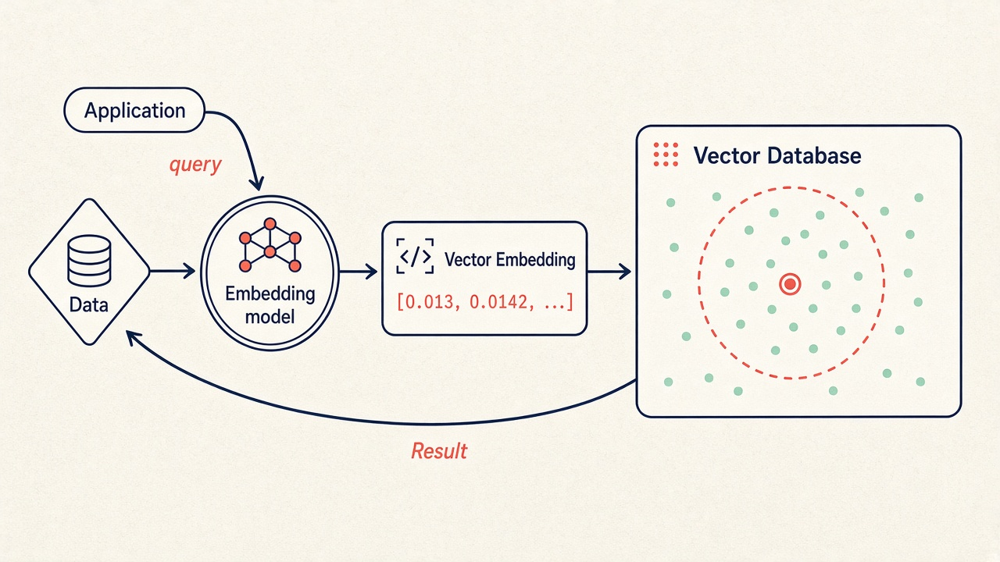

## 1. What is a Vector Database?



A **Vector Database** is a database designed to store and search **embeddings (vectors)** efficiently.

After converting data such as text or images into vectors, we need to store them so we can search and use them later.

For example:

```python
"pink windbreaker" → [0.12, -0.45, 0.78, ...]
```

A Vector Database stores this vector together with the original data and related information.

---

## 2. Why do we need a Vector Database?

Suppose we have 10,000 vectors and want to find the one most similar to a query.

The simplest approach would be:

```python
for vector in database:
    calculate_similarity(query, vector)
```

This means comparing the query with **all 10,000 vectors**.

As the number of vectors grows to millions, this becomes slow and expensive.

Vector Databases use **indexes** and algorithms such as **ANN (Approximate Nearest Neighbor)** to find similar vectors much faster, without comparing against every vector.

For example:

```python
results = collection.query(
    query_texts=["pink windbreaker"],
    n_results=2
)
```

The database returns the most relevant results based on vector similarity.

---

## 3. What are Vector Databases used for?

Most applications of Vector Databases are related to **searching by meaning** rather than exact keywords.

Common examples include:

* **Recommendation systems:** Find similar products and recommend them to users.
* **Image search:** Find visually similar images.
* **Semantic search:** Find relevant documents even when they use different words from the query.
* **Chatbots / RAG:** Store document embeddings so an LLM can retrieve relevant information before generating an answer.

In modern LLM applications, a Vector Database often works as an **external knowledge store**, allowing the LLM to retrieve information when needed.

---

## 4. What are some popular Vector Databases?

Some popular options include:

* **ChromaDB:** Simple and lightweight, great for learning and POCs.
* **Qdrant:** Open-source with good performance and suitable for production.
* **Weaviate:** Supports vector search and hybrid search.
* **Milvus:** Designed for large-scale vector search.
* **Pinecone:** Cloud-managed and easy to set up.
* **MongoDB Atlas Vector Search:** Useful if your application already uses MongoDB.
* **PostgreSQL + pgvector:** A popular option because you can keep vectors in your existing PostgreSQL database.

You do not always need a dedicated Vector Database. For smaller datasets, you can store vectors in memory or use an existing database such as PostgreSQL with `pgvector`.
