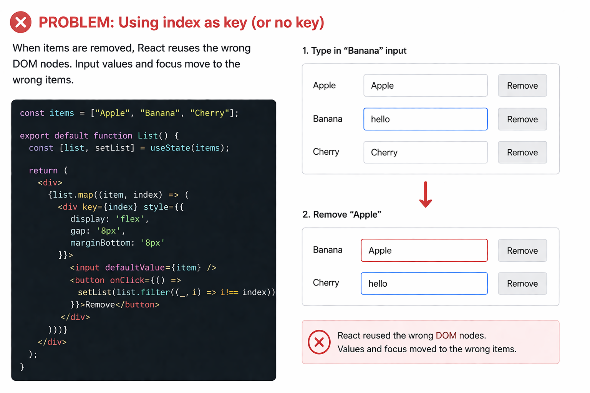

> When rendering arrays in React, `key` is how React tracks which item is which between renders.
> Without a proper `key`, React reuses the wrong DOM nodes when items are removed or reordered.



Fix: Add a unique `key` prop to each item in the array.

```tsx
const fruits = [
  { id: "a1", name: "Apple" },
  { id: "b2", name: "Banana" },
  { id: "c3", name: "Cherry" },
];

export default function FruitList() {
  const [items, setItems] = useState(fruits);

  return items.map((fruit) => (
    <div key={fruit.id}>
      <input defaultValue={fruit.name} />
      <button onClick={() => setItems(items.filter((i) => i.id !== fruit.id))}>
        Remove
      </button>
    </div>
  ));
}
```

# Key Reset

You can also change a `key` on purpose to force React to recreate an element and reset its state.

```tsx
<input key={resetKey} defaultValue="Apple" />
```

Change `resetKey` → React remounts the input → value and focus reset.
