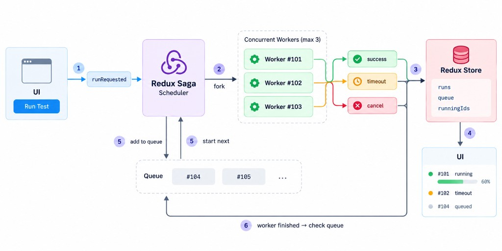

Redux Toolkit usually answers one question: **"What is the current state of the application?"**

Redux Saga answers a different question: **"What should happen next when an action occurs?"**

This post builds on [Redux Toolkit](/redux-toolkit/). Instead of learning Redux Saga effects one by one, we can understand them through a realistic example: a **Concurrent Test Runner**.




# The Problem

Imagine an application that runs automated tests. Multiple users can submit test runs:

However, the system only allows three tests to run at the same time, so `maxConcurrency = 3`.

```text
Running:
  #101
  #102
  #103

Queue:
  #104
  #105
```

When `#101` finishes, the scheduler starts `#104`:

If the user cancels `#103`, another queued task can take its place. If `#102` runs longer than the configured timeout, the worker is stopped and its status becomes `timeout`. The user can then retry the failed run.

# Reading and Updating Redux

```text
select → Saga reads Redux

put → Saga dispatches to Redux
```

These two effects form the basic communication layer between Saga and Redux.

**`select`** allows a Saga to read the current Redux state. For example, the scheduler might use `select(selectRunningIds)`, `select(selectMaxConcurrency)`, and `select(selectQueue)`.

**`put`** dispatches a Redux action from Saga. For example, a worker can call `yield put(runStarted(runId))` when it starts, `yield put(progressUpdated(...))` while running, and `yield put(runCompleted(...))` when it finishes.

# Running and Managing Tasks

With `call`, the Saga blocks until the operation finishes:

```ts
yield call(executeTests, runId);
```

With `fork`, the Saga starts a background task and continues immediately:

```ts
const task = yield fork(runTest, runId);
```

This allows multiple workers to run concurrently:

```text
Scheduler
   │
   ├── fork(#101) ──→ Worker #101
   ├── fork(#102) ──→ Worker #102
   └── fork(#103) ──→ Worker #103
```

## What is a `Task`?

When we write `const task = yield fork(runTest, runId)`, the returned `task` represents the running Saga.

We can later use it with `cancel(task)` or `join(task)`.

### join

`join` allows one Saga to wait for another Saga Task to finish. This is useful for a multi-user simulation where we start several background workers and then want to wait until all of them are complete.

```ts
const tasks = [];
for (const user of users) {
  tasks.push(yield fork(runUser, user));
}

for (const task of tasks) {
  yield join(task);
}
```

# Cancellation and Cleanup

When the user clicks **Cancel**, the scheduler can call `yield cancel(task)`. This is different from simply dispatching `runCancelled(runId)`. The Redux action changes application state, while `cancel(task)` actually sends a cancellation signal to the running Saga Task.

The `finally` block is useful because cleanup may be required when the task completes normally, throws an error, or gets cancelled.

Inside `finally`, `yield cancelled()` tells us whether the current Saga was cancelled:

```ts
function* runTest(runId: string) {
  try {
    yield call(executeTests, runId);
  } finally {
    if (yield cancelled()) {
      yield put(runCancelled(runId));
    }
  }
}
```

The important pattern is:

```text
try
 ↓
worker runs
 ↓
cancelled?
 ↓
finally
 ↓
cancelled() === true
 ↓
cleanup
```

# Timeout and Competing Workflows

A common requirement in the Test Runner is a timeout. For example, a test should not run longer than 30 seconds:

```ts
yield race({
  test: call(executeTests, runId),
  timeout: delay(30000),
});
```

There are now two competing branches:

```text
executeTests
     │
     ├── finishes first → test wins
     │
     └── 30 seconds → timeout wins
```

This is what `race` is designed for: **multiple effects compete, and the first one to finish wins**. The losing branches are cancelled.

We can add user cancellation as a third branch:

```ts
const isCancelForRun = (runId: string) => (action) =>
  cancelRun.match(action) && action.payload === runId;

const { test, timeout, cancel } = yield race({
  test: call(executeTests, runId),
  timeout: delay(30000),
  cancel: take(isCancelForRun(runId)),
});
```

Now the worker is waiting for three possible outcomes:

```text
             ┌── test completes
race ────────┼── timeout
             └── user cancels
```

Whichever happens first wins, and only the winning key is set in the result.

# Watching Actions

`takeEvery` and `takeLatest` control how Saga responds to repeated actions.

With `takeEvery`:

```ts
yield takeEvery(
  runRequested.type,
  handleRunRequested
);
```

This is usually appropriate for `runRequested` because we don't want a new test submission to silently replace an earlier one.

`takeLatest` behaves differently:

```ts
yield takeLatest(
  searchRequested.type,
  searchSaga
);
```

If the user searches repeatedly:

```text
search("rea")
search("reac")
search("react")
```

the previous Saga can be cancelled so that only the latest request remains active.

```text
search #1 ──X
search #2 ──X
search #3 ─────────→ execute
```