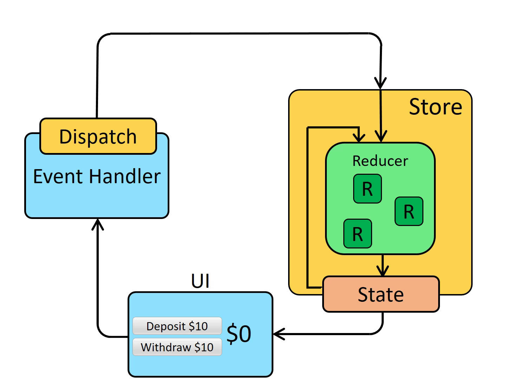

> Redux Toolkit (RTK) is the **official, recommended way** to write Redux. It keeps Redux's core ideas but removes most of the boilerplate.



# Why Redux Toolkit?

Plain Redux asks you to write a lot of code by hand: action type constants, action creator functions, `switch` reducers, copying objects to keep state immutable, and store setup. Redux Toolkit does this work for you.

| Plain Redux | Redux Toolkit |
|---|---|
| Write action types and action creators by hand | `createSlice` generates them |
| Copy state with spread (`...state`) | Write `state.value++`, Immer keeps it immutable |
| Set up middleware and DevTools manually | `configureStore` does it by default |
| Write your own async action logic | `createAsyncThunk` handles loading and errors |

# Key Terms

* **Store**: the single object that holds the whole app state.
* **Slice**: one feature's piece of state plus the functions that change it, for example `counter` or `users`.
* **Action**: a plain object describing what happened, such as `{ type: "counter/increment" }`.
* **Reducer**: a function that receives the current state and an action, and returns the new state.
* **Dispatch**: sending an action to the store.
* **Selector**: a function that reads a value from the store.

# How Data Flows

```text
User clicks a button
   ↓
Component dispatches an action
   ↓
Reducer updates the state
   ↓
Store saves the new state
   ↓
Components using that state re-render
```

The data always moves in one direction, which makes it easy to trace why something changed.

# 1. Create a Slice

A slice holds the initial state and the reducers for one feature.

```ts
// features/counter/counterSlice.ts
import { createSlice, PayloadAction } from "@reduxjs/toolkit";

type CounterState = { value: number };

const initialState: CounterState = { value: 0 };

const counterSlice = createSlice({
  name: "counter",
  initialState,
  reducers: {
    increment(state) {
      state.value++;
    },
    decrement(state) {
      state.value--;
    },
    incrementBy(state, action: PayloadAction<number>) {
      state.value += action.payload;
    },
  },
});

export const { increment, decrement, incrementBy } = counterSlice.actions;
export default counterSlice.reducer;
```

From this one call, RTK generates:

* **Action types**: `"counter/increment"`, `"counter/decrement"`, `"counter/incrementBy"`
* **Action creators**: `increment()` returns `{ type: "counter/increment" }`, and `incrementBy(5)` returns `{ type: "counter/incrementBy", payload: 5 }`
* **The reducer**: `counterSlice.reducer`, which handles all of these actions

# 2. Create the Store

```ts
// app/store.ts
import { configureStore } from "@reduxjs/toolkit";
import counterReducer from "../features/counter/counterSlice";

export const store = configureStore({
  reducer: {
    counter: counterReducer,
  },
});

export type RootState = ReturnType<typeof store.getState>;
export type AppDispatch = typeof store.dispatch;
```

`configureStore` automatically:

* Combines the slice reducers into one root reducer
* Adds the thunk middleware, which is needed for async logic
* Adds checks that warn you if you mutate state by mistake
* Connects to Redux DevTools

Then give the store to React with `Provider`:

```tsx
// main.tsx
import { Provider } from "react-redux";
import { store } from "./app/store";

root.render(
  <Provider store={store}>
    <App />
  </Provider>
);
```

# 3. Use It in Components

Create typed versions of the hooks once, so TypeScript knows the shape of your state:

```ts
// app/hooks.ts
import { useDispatch, useSelector } from "react-redux";
import type { AppDispatch, RootState } from "./store";

export const useAppDispatch = useDispatch.withTypes<AppDispatch>();
export const useAppSelector = useSelector.withTypes<RootState>();
```

Then read state with `useAppSelector` and send actions with `useAppDispatch`:

```tsx
// features/counter/Counter.tsx
import { useAppDispatch, useAppSelector } from "../../app/hooks";
import { increment, decrement, incrementBy } from "./counterSlice";

export function Counter() {
  const count = useAppSelector((state) => state.counter.value);
  const dispatch = useAppDispatch();

  return (
    <div>
      <button onClick={() => dispatch(decrement())}>-</button>
      <span>{count}</span>
      <button onClick={() => dispatch(increment())}>+</button>
      <button onClick={() => dispatch(incrementBy(5))}>+5</button>
    </div>
  );
}
```

The component re-renders only when the value it selects (`state.counter.value`) changes.

# 4. Why `state.value++` Is Safe

Redux state must never be changed directly. You always return a new object. In plain Redux, that means writing copies by hand:

```ts
// Plain Redux
return { ...state, value: state.value + 1 };
```

RTK uses a library called **Immer**. Inside `createSlice` reducers you can write code that looks like it mutates the state, and Immer turns it into a safe, immutable update:

```ts
// Redux Toolkit
state.value++;
```

This only works inside RTK reducers. Anywhere else, never mutate state.

# 5. Async Logic with `createAsyncThunk`

Reducers must be pure and synchronous, so API calls do not go inside them. Instead, use `createAsyncThunk` to create a function that fetches data and reports its progress through actions.

### Step 1: Create the thunk

```ts
// features/users/usersSlice.ts
import { createAsyncThunk, createSlice } from "@reduxjs/toolkit";

type User = { id: number; name: string };

export const fetchUsers = createAsyncThunk("users/fetch", async () => {
  const res = await fetch("/api/users");
  if (!res.ok) throw new Error("Failed to fetch users");
  return (await res.json()) as User[];
});
```

Whatever the function returns becomes the payload of the success action. If it throws, RTK dispatches the failure action instead.

### Step 2: Handle the three states in the slice

When you dispatch `fetchUsers()`, RTK dispatches up to three actions:

| Action | When | Typical update |
|---|---|---|
| `users/fetch/pending` | The request starts | Show a loading state |
| `users/fetch/fulfilled` | The request succeeds | Save the data |
| `users/fetch/rejected` | The request fails | Save the error |

These actions are not defined in `reducers`, so they are handled in `extraReducers`:

```ts
type UsersState = {
  items: User[];
  status: "idle" | "loading" | "succeeded" | "failed";
  error: string | null;
};

const initialState: UsersState = {
  items: [],
  status: "idle",
  error: null,
};

const usersSlice = createSlice({
  name: "users",
  initialState,
  reducers: {},
  extraReducers: (builder) => {
    builder
      .addCase(fetchUsers.pending, (state) => {
        state.status = "loading";
        state.error = null;
      })
      .addCase(fetchUsers.fulfilled, (state, action) => {
        state.status = "succeeded";
        state.items = action.payload;
      })
      .addCase(fetchUsers.rejected, (state, action) => {
        state.status = "failed";
        state.error = action.error.message ?? "Failed to fetch users";
      });
  },
});

export default usersSlice.reducer;
```

Remember to add `users: usersReducer` to the store's `reducer` object.

### Step 3: Dispatch it from a component

```tsx
// features/users/UserList.tsx
import { useEffect } from "react";
import { useAppDispatch, useAppSelector } from "../../app/hooks";
import { fetchUsers } from "./usersSlice";

export function UserList() {
  const dispatch = useAppDispatch();
  const { items, status, error } = useAppSelector((state) => state.users);

  useEffect(() => {
    if (status === "idle") dispatch(fetchUsers());
  }, [status, dispatch]);

  if (status === "loading") return <p>Loading...</p>;
  if (status === "failed") return <p>Error: {error}</p>;

  return (
    <ul>
      {items.map((user) => (
        <li key={user.id}>{user.name}</li>
      ))}
    </ul>
  );
}
```

The full async flow:

```text
dispatch(fetchUsers())
   ↓
pending    → status = "loading"
   ↓
API call
   ↓
fulfilled  → status = "succeeded", items = data
  or
rejected   → status = "failed", error = message
   ↓
UserList re-renders
```

# Which Tool Should I Use?

* **`createSlice`**: for any state that changes in the browser, such as UI state, forms, or a shopping cart.
* **`createAsyncThunk`**: for simple async work, such as loading data once or submitting a form.
* **RTK Query**: for fetching and caching server data. It handles loading, caching, and refetching for you, so you don't write thunks or reducers for API data at all.
* **Redux Saga**: for complex workflows such as queues, cancellation, timeouts, or long-running background tasks.

# Summary

* A **slice** groups one feature's state and reducers. `createSlice` generates the actions for you.
* `configureStore` sets up the store with sensible defaults.
* Components read with `useSelector` and update with `useDispatch`.
* Immer lets you write `state.value++` safely inside reducers.
* `createAsyncThunk` turns one async function into `pending`, `fulfilled`, and `rejected` actions, which you handle in `extraReducers`.
