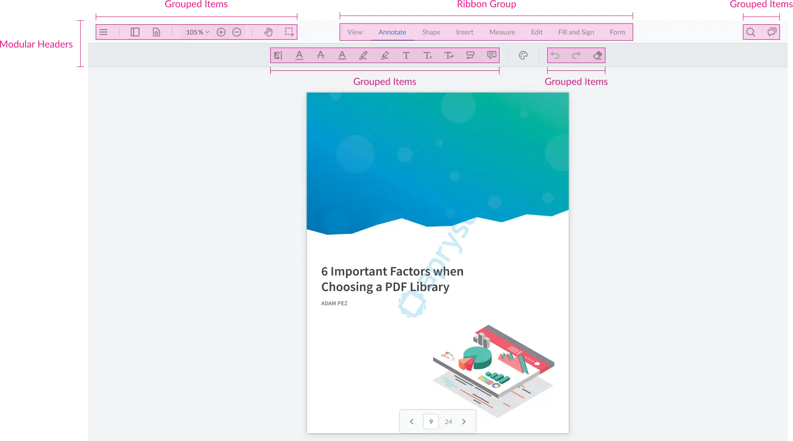

Modern document applications demand highly customizable interfaces. Whether you're building a PDF viewer, annotation 
platform, or document workflow application, the ability to tailor the user experience is essential. WebViewer's Modular 
UI introduces a flexible, component-based architecture that makes UI customization easier than ever.

At the heart of the system are two building blocks:

* **Items** – Individual UI elements such as buttons, zoom controls, dividers, and tool controls.
* **Containers** – Components that organize and display items within the interface.

## Understanding Containers

Containers are responsible for organizing the structure of the UI. They can hold items and, in some cases, other containers, enabling complex layouts without modifying source code.

The three primary container types are:

1. Modular Headers
2. Grouped Items
3. Ribbon Groups

Each serves a different purpose in organizing the user interface.

## Modular Headers: The Foundation of the UI

Modular Headers are the highest-level containers in WebViewer. They act as the main toolbar regions where other components are placed.

Unlike traditional toolbars, Modular Headers can be positioned in multiple locations:

* Top
* Left
* Right
* Bottom

This flexibility allows developers to quickly redesign the application's layout by simply changing a configuration property.

For example, a tools panel that normally appears at the top can be moved to the left side of the screen without rebuilding the UI.

Modular Headers also support customization options such as:

* Item spacing
* Alignment and justification
* Styling and theming
* Dynamic item management

Developers can either replace the default headers completely or add new headers alongside existing ones.

## Grouped Items: Organizing Related Controls

Grouped Items are lightweight containers used to organize related controls and actions.

Common use cases include:

* Annotation tools
* Navigation controls
* Document actions
* Custom feature groups

Grouped Items behave similarly to CSS flexbox containers, making them easy to align and style.

One particularly useful feature is automatic overflow management. When there isn't enough room to display every item, WebViewer automatically moves excess controls into a "More" menu, keeping the interface clean and responsive.

Grouped Items can also be configured to:

* Always remain visible
* Appear only when activated
* Grow dynamically within available space
* Support custom styling and layouts

## Ribbon Groups: Creating Tab-Based Experiences

Ribbon Groups enable developers to build interfaces similar to Microsoft Office applications.

A Ribbon Group contains Ribbon Items, which act as tabs. Each tab is associated with one or more Grouped Items containers.

For example:

* Text Tools
* Shape Tools
* Insert Tools

When a user selects a ribbon tab, the corresponding tool group becomes visible.

This approach keeps large toolsets organized and improves discoverability without overwhelming users with too many controls at once.

Ribbon Groups also support responsive behavior, automatically collapsing into menus or dropdowns when screen space becomes limited.

## Dynamic UI Updates

One of the biggest advantages of Modular UI is that components can be modified at runtime.

Developers can:

* Add or remove tools dynamically
* Replace entire groups of controls
* Change layouts programmatically
* Switch active ribbon tabs
* Update styling without rebuilding the interface

This makes it easy to adapt the interface based on user roles, workflows, or application state.

## Why Developers Choose Modular UI

The Modular UI architecture offers several advantages:

### Easier Customization

Build custom experiences without modifying the core source code.

### Reusable Components

Items and containers can be reused throughout the application.

### Better Maintainability

API-based customization reduces upgrade complexity and maintenance effort.

### Responsive Design

Automatic overflow handling ensures a consistent experience across screen sizes.

### Flexible Layouts

Move toolbars, create custom ribbons, and reorganize controls with minimal effort.

## Conclusion

WebViewer Modular UI provides a powerful, scalable approach to interface customization. By combining Modular Headers, Grouped Items, and Ribbon Groups, developers can create highly tailored document experiences while maintaining a clean and maintainable codebase.

Whether you're making small adjustments to the default toolbar or building a completely custom document viewer, Modular UI offers the flexibility needed to deliver modern, user-friendly interfaces.
