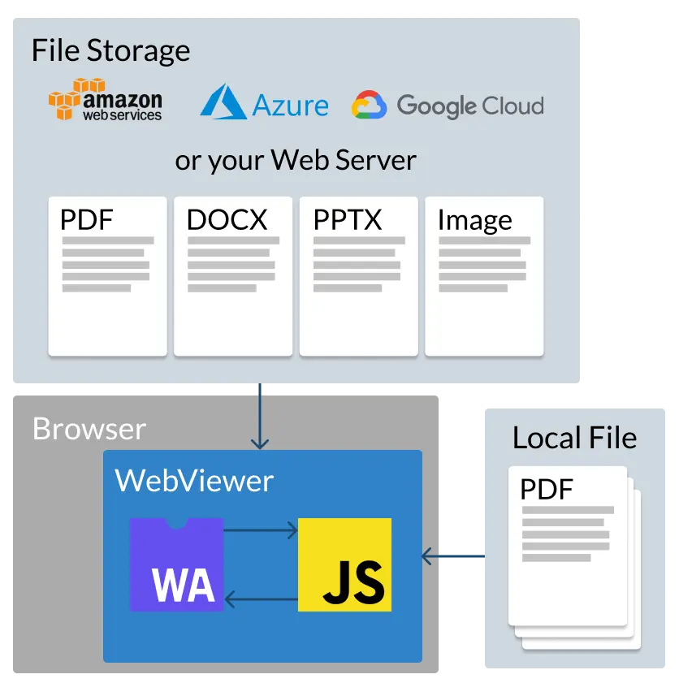
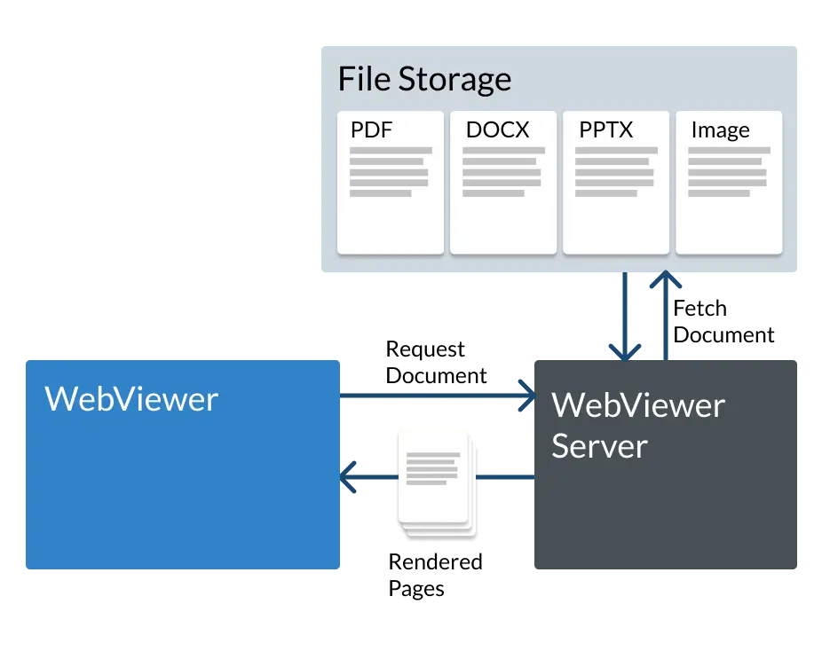

WebViewer is a client-side JavaScript SDK that enables developers to view, edit, annotate, search, redact, sign, 
compare, and manipulate documents directly inside web applications. It also includes dedicated editors for 
DOCX and XLSX files, allowing users to work with Office documents without leaving the application. 

## How It Works

At its core, WebViewer leverages WebAssembly to run Apryse’s C++ document-processing engine directly in the browser. 
This client-side architecture eliminates the need for rendering servers in most scenarios, reducing infrastructure 
complexity while improving scalability. 

A basic implementation requires only a document URL and a target DOM element:

```javascript
WebViewer({
  initialDoc: 'document.pdf'
}, document.getElementById('viewer'));
```



## WebViewer Server

For older browsers, lower-powered devices, or additional file format support, Apryse offers **WebViewer Server**, 
a backend service that complements client-side rendering. It delivers optimized performance by initially serving 
rendered images and transitioning to client-side rendering when possible. 



## Developer-Friendly Architecture

WebViewer exposes two primary namespaces:

* **Core** – Document processing, viewing, annotations, search, and tools.
* **UI** – Interface customization, theming, localization, and user interactions. 

This separation allows developers to quickly customize the user experience while maintaining access to powerful document APIs.