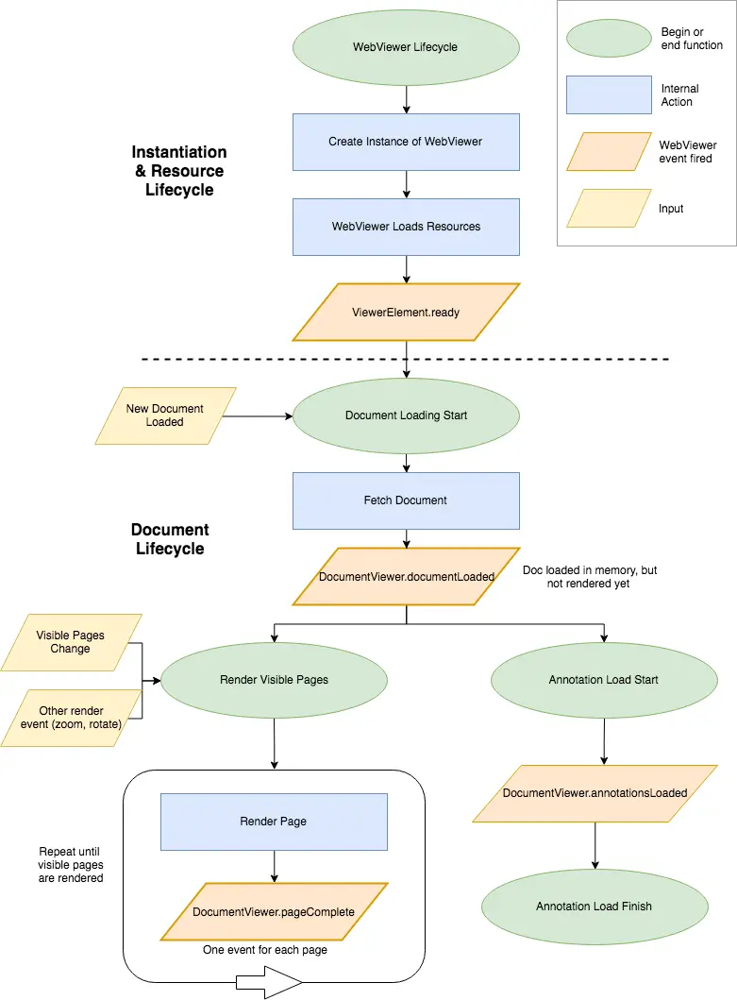

When working with WebViewer, knowing *when* to run your code is just as important as knowing *what* code to write. 
WebViewer provides a lifecycle of events that allow you to react as the viewer initializes, documents load, annotations 
become available, and users interact with content.



## 1. WebViewer Ready

The first event you'll encounter is when the `WebViewer()` promise resolves.

```js
WebViewer(options, viewerElement).then(instance => {
  // Setup code
});
```

This is the ideal place to:

* Customize the UI
* Register event listeners
* Configure tools
* Load documents

Think of this as your application's initialization phase.

## 2. documentLoaded

Once a document is loaded into memory, the `documentLoaded` event fires.

```js
documentViewer.addEventListener('documentLoaded', () => {
  // Work with the document
});
```

Use this event for:

* Page manipulation
* Loading document-specific data
* Importing annotations
* Initializing collaboration features

## 3. pageComplete

As pages render, WebViewer triggers the `pageComplete` event.

```js
documentViewer.addEventListener('pageComplete', pageNumber => {
  // Page fully rendered
});
```

This is useful when you need access to rendered page content, canvases, or custom overlays.

## 4. annotationsLoaded

Annotations are loaded asynchronously. When all annotations are available, `annotationsLoaded` fires.

```js
documentViewer.addEventListener('annotationsLoaded', () => {
  // All annotations available
});
```

Use this event when exporting, processing, or displaying annotation-related data.

## 5. User Interaction Events

After the document is fully loaded, WebViewer continuously emits events based on user activity:

### Viewer Events

* `pageNumberUpdated`
* `zoomUpdated`
* `searchResultsChanged`

### UI Events

* `toolbarGroupChanged`
* `selectedThumbnailChanged`

### Annotation Events

* `annotationChanged`
* `annotationSelected`
* `annotationDeselected`

### Text Selection Events

* `textSelected`
* `selectionComplete`

These events allow you to build custom workflows, analytics, autosave functionality, and interactive experiences.

## A Real-World Example

A common workflow is loading annotations from a server and automatically saving user changes.

1. Configure WebViewer when it's ready.
2. Load annotations when the document loads.
3. Wait for annotations to finish loading.
4. Save changes whenever annotations are modified.

This pattern is used in document review, collaboration, and approval workflows.

## Key Takeaways

* Register event listeners inside `WebViewer().then()`.
* Use `documentLoaded` for document-related operations.
* Use `annotationsLoaded` when working with annotations.
* Use `annotationChanged` to detect user edits.
* Avoid adding permanent event listeners inside `documentLoaded`, as it fires every time a new document is opened.

By understanding the lifecycle and choosing the correct event for each task, you can build reliable and performant WebViewer applications.
