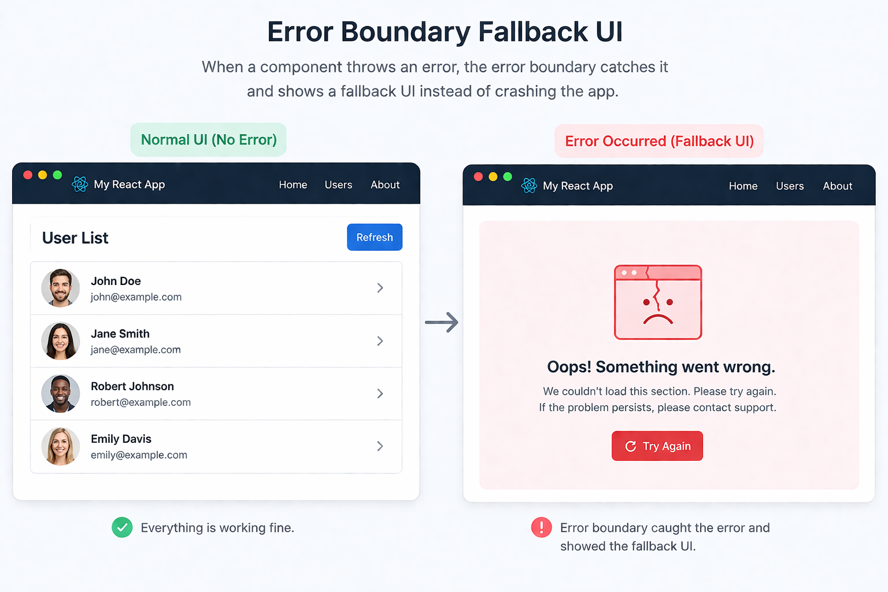

> In React, if a component throws during render and nothing catches it, React can unmount the whole tree and users may see a blank screen.

> **Error Boundaries** prevent that by catching render-time errors and showing a fallback UI instead.




# Error Boundaries

In real apps, prefer use *react-error-boundary* library.

> npm install react-error-boundary

```tsx
import { ErrorBoundary } from "react-error-boundary";

function Fallback({ error, resetErrorBoundary }) {
  return (
    <div>
      <p>Failed to load data: {error.message}</p>
      <button onClick={resetErrorBoundary}>Retry</button>
    </div>
  );
}

function App() {
  return (
    <ErrorBoundary FallbackComponent={Fallback}>
      <UserList />
    </ErrorBoundary>
  );
}
```

# Handling Async Errors

Error boundaries only catch errors that happen during **rendering**. 

Not in:

* Event handlers
* `useEffect`
* Promises or async code

To handle those, you can manually surface them to an error boundary using `useErrorBoundary()`:

```tsx
import { ErrorBoundary, useErrorBoundary } from "react-error-boundary";
import { useEffect } from "react";

function Users() {
  const { showBoundary } = useErrorBoundary();

  useEffect(() => {
    fetch("/api/users")
      .then((res) => {
        if (!res.ok) throw new Error("Failed to load users");
        return res.json();
      })
      .catch(showBoundary); // send async error to ErrorBoundary
  }, [showBoundary]);

  return <div>User List</div>;
}

function Fallback({ error }) {
  return <div>{error.message}</div>;
}

export default function App() {
  return (
    <ErrorBoundary FallbackComponent={Fallback}>
      <Users />
    </ErrorBoundary>
  );
}
```